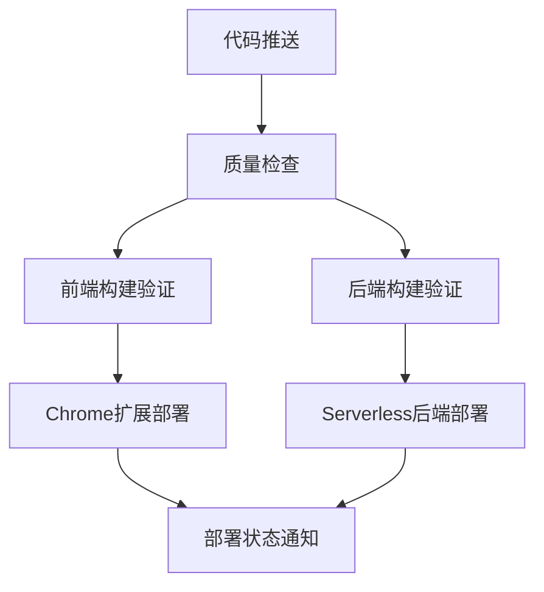

# 🚀 双端部署CI/CD配置说明

## 🎯 **项目架构理解**

### **前端 (Chrome Extension)**:
- **技术栈**: Vue 3 + TypeScript + IndexedDB + Vite
- **构建产物**: Chrome插件压缩包 (.zip)
- **部署目标**: Google Chrome Web Store
- **功能**: 用户界面、书签管理、本地数据存储

### **后端 (Serverless Functions)**:
- **技术栈**: Bun (本地开发) → Node.js (Vercel部署)
- **部署目标**: Vercel Serverless Functions
- **功能**: AI LLM调用、网络抓包处理、数据分析
- **API端点**: `/api/ai/*`, `/api/scraper/*`, `/api/job/*`

---

## 🔄 **CI/CD工作流程**

### **dual-deployment-ci.yml** 工作流程:



### **1. 🔍 质量检查阶段**
- **安全审计**: `bun audit` (前后端)
- **TypeScript检查**: 前端类型验证
- **代码质量**: ESLint检查 (前后端)

### **2. 🔨 构建验证阶段**

#### **Chrome扩展构建**:
- Vue 3项目构建 (`bun run build:prod`)
- 扩展大小分析 (限制20MB)
- Manifest.json验证
- 文件结构检查
- 创建扩展包 (.zip)

#### **Serverless后端构建**:
- Bun项目语法检查
- 服务器功能测试
- 性能基准测试
- Vercel兼容性检查

### **3. 🚀 部署阶段**

#### **Chrome扩展部署**:
- 构建生产版本
- 创建发布包
- 部署到Chrome Web Store (需要API密钥)
- 创建GitHub Release

#### **Serverless后端部署**:
- 准备Vercel配置
- 部署到Vercel Serverless
- 创建后端版本Release

---

## ⚙️ **必需的Secrets配置**

### **Chrome Web Store部署**:
```
CHROME_CLIENT_ID=your_chrome_client_id
CHROME_CLIENT_SECRET=your_chrome_client_secret
CHROME_REFRESH_TOKEN=your_chrome_refresh_token
CHROME_EXTENSION_ID=your_extension_id
```

### **Vercel部署**:
```
VERCEL_TOKEN=your_vercel_token
ORG_ID=your_vercel_org_id
PROJECT_ID=your_vercel_project_id
```

---

## 📁 **新增的配置文件**

### **backend/vercel.json**
```json
{
  "version": 2,
  "builds": [
    {
      "src": "server-bun-native.js",
      "use": "@vercel/node"
    }
  ],
  "routes": [
    {
      "src": "/(.*)",
      "dest": "/server-bun-native.js"
    }
  ]
}
```

### **backend/api/index.js**
Vercel Serverless Functions适配层，提供:
- **AI服务**: `/api/ai/analyze`, `/api/ai/query`
- **抓包服务**: `/api/scraper/fetch`
- **任务状态**: `/api/job/{jobId}`
- **健康检查**: `/health`

---

## 🔧 **开发环境vs生产环境**

### **开发环境**:
- **前端**: `bun run dev` (Vite开发服务器)
- **后端**: `bun run dev` (Bun原生服务器)
- **集成**: 通过本地API调用测试

### **生产环境**:
- **前端**: Chrome Web Store分发
- **后端**: Vercel Serverless Functions
- **集成**: Chrome扩展 ↔ Vercel API

---

## 📊 **部署监控**

### **成功指标**:
- ✅ 前端构建无错误
- ✅ Chrome扩展包 < 20MB
- ✅ Manifest.json通过验证
- ✅ 后端API响应正常
- ✅ Vercel部署成功

### **部署状态**:
- **完全成功**: 前端 + 后端都部署成功
- **部分成功**: 单端部署成功，另一端失败
- **完全失败**: 前后端都部署失败

---

## 🚨 **故障排除**

### **常见问题**:

#### **1. Chrome扩展构建失败**
```bash
# 检查构建脚本
cd frontend
bun run build:prod

# 检查文件大小
du -sh ../dist

# 验证manifest
jq . ../dist/manifest.json
```

#### **2. Vercel部署失败**
```bash
# 本地测试后端
cd backend
bun run start

# 检查API端点
curl http://localhost:3000/health
curl http://localhost:3000/api
```

#### **3. API集成问题**
- 检查CORS配置
- 验证API端点URL
- 确认环境变量设置

---

## 🎯 **最佳实践**

### **代码质量**:
- 每次提交前运行 `bun run lint:check`
- 使用 `bun run type-check` 验证TypeScript
- 定期运行安全审计 `bun audit`

### **部署策略**:
- 使用feature branches开发
- main分支触发生产部署
- 通过GitHub Releases管理版本

### **监控与维护**:
- 关注CI/CD构建状态
- 监控Chrome Web Store审核状态
- 检查Vercel Serverless Functions性能指标

---

## 📈 **未来改进**

### **可考虑的增强功能**:
- **测试覆盖**: 添加单元测试和集成测试
- **性能监控**: 添加构建时间和包大小趋势分析
- **自动回滚**: 部署失败时的自动回滚机制
- **多环境支持**: 添加staging环境
- **更好的错误处理**: 更详细的失败通知和日志

---

## 🎉 **总结**

这个双端部署CI/CD配置为AcuityBookmarks项目提供了：

- ✅ **完整的自动化流程**: 从代码提交到生产部署
- ✅ **双端同步部署**: Chrome扩展 + Serverless后端
- ✅ **质量保证**: 代码检查、构建验证、安全审计
- ✅ **灵活的配置**: 适应项目特定需求
- ✅ **清晰的监控**: 部署状态和错误报告

确保Chrome扩展的用户体验与后端API服务的完美集成！🚀
