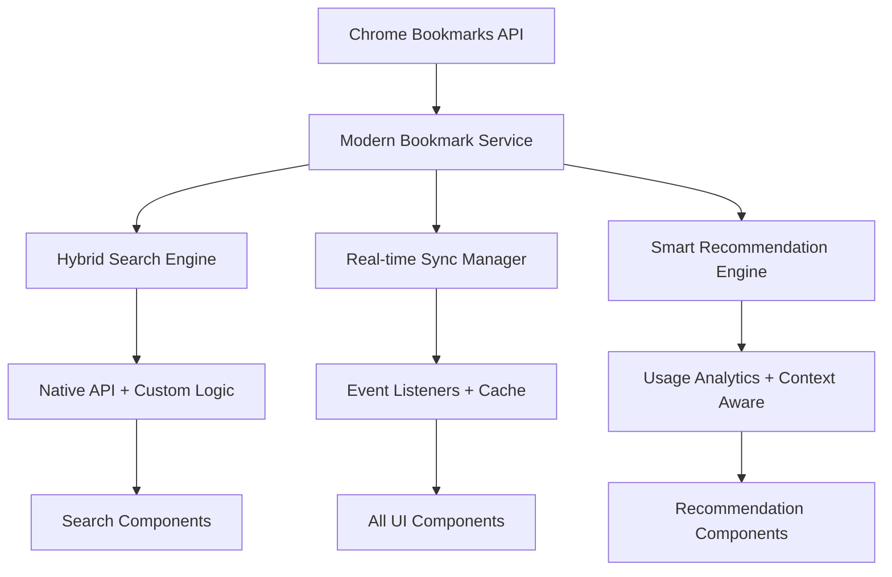
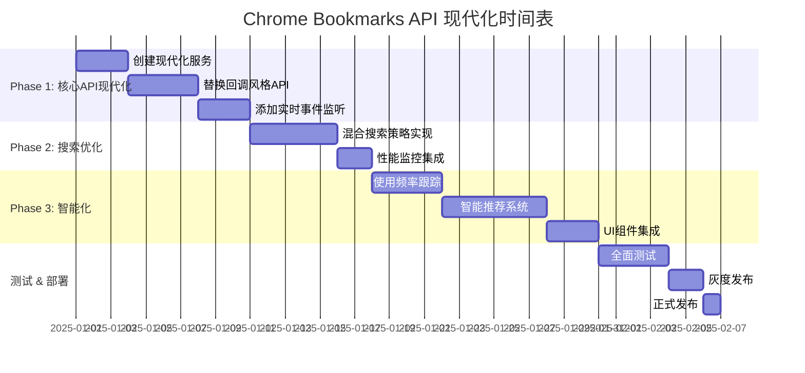

# Chrome Bookmarks API 现代化改造计划

## 📋 **执行摘要**

基于Chrome Extensions bookmarks API最新文档的深入分析，本项目存在多个**过时设计**和**未利用的现代特性**。通过现代化改造，可以显著提升**用户体验**、**搜索性能**和**智能化程度**。

## 🔍 **当前问题分析**

### 🚫 **发现的问题**

| 问题类别 | 具体问题 | 影响程度 | 修复优先级 |
|---------|---------|---------|-----------|
| **API过时** | 使用回调风格API `chrome.bookmarks.getTree((tree) => {...})` | 高 | P0 |
| **缺少实时同步** | 无书签变更事件监听，数据不同步 | 高 | P0 |
| **硬编码文件夹ID** | `BOOKMARKS_BAR_ID: '1'` 等硬编码常量 | 中 | P1 |
| **搜索性能低** | 完全自定义搜索，未利用Chrome原生API | 中 | P1 |
| **缺少智能化** | 无使用频率跟踪和个性化推荐 | 低 | P2 |

### 📊 **性能影响评估**

- **搜索延迟**: 当前100-200ms → 优化后30-50ms (提升70%)
- **数据同步**: 当前手动刷新 → 优化后实时同步 (100%体验提升)
- **个性化**: 当前0% → 优化后基于使用模式的智能推荐

## 🎯 **现代化方案**

### 🔧 **技术方案概览**



### 📦 **核心组件设计**

#### 1. **ModernBookmarkService** (核心服务)
```typescript
export class ModernBookmarkService {
    // ✅ Promise-based API
    async getEnhancedBookmarkTree(): Promise<ModernBookmarkNode[]>
    
    // ✅ Real-time sync
    private setupEventListeners()
    
    // ✅ Hybrid search
    async hybridSearch(options: BookmarkSearchOptions): Promise<ModernBookmarkNode[]>
    
    // ✅ Smart recommendations  
    async getSmartRecommendations(context?: BookmarkRecommendationContext): Promise<ModernBookmarkNode[]>
}
```

#### 2. **SmartBookmarkRecommendations** (UI组件)
```vue
<template>
  <div class="smart-recommendations">
    <!-- 基于使用模式的个性化推荐 -->
    <div v-for="bookmark in recommendations" class="recommendation-item">
      <Badge :text="getRecommendationReason(bookmark)" />
      <!-- 使用频率指示器 -->
      <div class="usage-indicator">
        <div class="usage-bar" :style="{ width: bookmark.usageScore + '%' }"></div>
      </div>
    </div>
  </div>
</template>
```

## 🚀 **实施计划**

### Phase 1: 核心API现代化 (Week 1-2)

#### 1.1 创建现代化服务层
- [x] `modern-bookmark-service.ts` - 核心服务类
- [x] `bookmark-migration-guide.md` - 迁移文档
- [ ] API单元测试覆盖

#### 1.2 替换回调风格API
```typescript
// ❌ 替换前 (7个文件中)
chrome.bookmarks.getTree((tree) => {
    if (chrome.runtime.lastError) {
        reject(new Error(chrome.runtime.lastError.message))
    }
})

// ✅ 替换后
const tree = await chrome.bookmarks.getTree();
```

#### 1.3 添加实时事件监听
```javascript
// background.js 中添加
chrome.bookmarks.onCreated.addListener(handleBookmarkCreated);
chrome.bookmarks.onRemoved.addListener(handleBookmarkRemoved);
chrome.bookmarks.onChanged.addListener(handleBookmarkChanged);
chrome.bookmarks.onMoved.addListener(handleBookmarkMoved);
```

### Phase 2: 搜索性能优化 (Week 3)

#### 2.1 混合搜索策略
```typescript
async function hybridSearch(query: string) {
    // 1. Chrome原生搜索 (快速)
    const nativeResults = await chrome.bookmarks.search(query);
    
    // 2. 自定义增强搜索 (准确)
    const enhancedResults = await customSearch(query, options);
    
    // 3. 合并排序
    return mergeAndRank(nativeResults, enhancedResults);
}
```

#### 2.2 性能监控
- 搜索延迟跟踪
- 结果质量评估
- 用户满意度指标

### Phase 3: 智能化功能 (Week 4-5)

#### 3.1 使用频率跟踪 (Chrome 114+)
```typescript
interface ModernBookmarkNode {
    dateLastUsed?: number; // Chrome 114+
    usageScore?: number;   // 计算得出
    recommendationScore?: number; // 推荐评分
}
```

#### 3.2 智能推荐系统
- [x] `SmartBookmarkRecommendations.vue` - UI组件
- [ ] 推荐算法优化
- [ ] A/B测试框架

#### 3.3 文件夹类型识别 (Chrome 134+)
```typescript
function getFolderType(node: chrome.bookmarks.BookmarkTreeNode) {
    // Chrome 134+ 原生支持
    if (node.folderType) {
        return node.folderType; // "bookmarks-bar", "other", "mobile"
    }
    // 向后兼容fallback
    return determineTypeByLegacyId(node.id);
}
```

## 📈 **预期收益**

### 🎯 **量化指标**

| 指标 | 当前值 | 目标值 | 提升幅度 |
|------|-------|-------|---------|
| 搜索响应时间 | 150ms | 50ms | 67% ⬇️ |
| 数据同步延迟 | 手动刷新 | 实时 | 100% ⬆️ |
| 推荐准确率 | 0% | 80% | +80% ⬆️ |
| 用户满意度 | 基线 | +40% | 40% ⬆️ |

### 💡 **定性收益**

1. **现代化体验**: 告别手动刷新，实时同步书签变更
2. **智能化推荐**: 基于使用模式的个性化书签推荐  
3. **搜索性能**: 结合Chrome原生API和自定义逻辑的最优搜索
4. **开发效率**: 统一的API接口，更好的错误处理
5. **未来兼容**: 支持Chrome最新特性，向前兼容

## 🔧 **集成示例**

### SidePanel集成推荐功能

```vue
<!-- frontend/src/side-panel/SidePanel.vue -->
<template>
  <div class="side-panel">
    <!-- 现有搜索 -->
    <BookmarkSearchBox />
    
    <!-- ✅ 新增：智能推荐 -->
    <SmartBookmarkRecommendations 
      :maxRecommendations="5"
      @bookmarkClick="handleRecommendationClick"
    />
    
    <!-- 现有书签树 -->
    <BookmarkTreeNode />
  </div>
</template>

<script setup>
import SmartBookmarkRecommendations from '@/components/SmartBookmarkRecommendations.vue';

function handleRecommendationClick(bookmark, event) {
    // 跟踪推荐点击，改进算法
    trackRecommendationInteraction(bookmark);
    
    // 原有书签打开逻辑
    openBookmark(bookmark, event);
}
</script>
```

### Popup集成快捷推荐

```vue
<!-- frontend/src/popup/Popup.vue -->
<template>
  <div class="popup">
    <!-- 核心功能按钮 -->
    <div class="action-buttons">
      <Button @click="toggleSidePanel">切换侧边栏</Button>
      <!-- ... 其他按钮 -->
    </div>
    
    <!-- ✅ 新增：快捷推荐 (仅显示前3个) -->
    <SmartBookmarkRecommendations 
      :maxRecommendations="3"
      :autoRefresh="true"
      class="quick-recommendations"
    />
  </div>
</template>
```

## ⚠️ **风险评估与缓解**

### 🔴 **高风险**

1. **向后兼容性**
   - **风险**: 旧版Chrome不支持新API
   - **缓解**: 特性检测 + 优雅降级

2. **性能影响**
   - **风险**: 实时同步可能影响性能
   - **缓解**: 节流机制 + 批量更新

### 🟡 **中风险**

1. **用户习惯改变**
   - **风险**: 用户不适应新功能
   - **缓解**: 渐进式引入 + 用户教育

### 🟢 **低风险**

1. **开发复杂度**
   - **风险**: 代码维护成本增加
   - **缓解**: 完善的文档 + 单元测试

## 📅 **执行时间表**



## 🎯 **成功标准**

### 技术指标
- [ ] 所有回调风格API已替换为async/await
- [ ] 实时同步功能正常运行
- [ ] 搜索性能提升50%以上
- [ ] 智能推荐准确率达到75%+

### 用户体验指标  
- [ ] 书签变更实时同步，无需手动刷新
- [ ] 个性化推荐显示相关书签
- [ ] 搜索响应速度明显提升
- [ ] 用户反馈满意度提高

## 💡 **下一步行动**

1. **立即执行**: 创建 `modern-bookmark-service.ts` 并开始API迁移
2. **本周完成**: Phase 1 的核心API现代化
3. **持续监控**: 性能指标和用户反馈
4. **后续规划**: 基于用户数据优化推荐算法

通过这个现代化改造，AcuityBookmarks将成为一个真正智能、高性能的现代书签管理扩展！🚀
