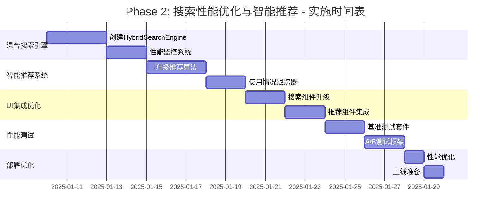

# 🚀 Phase 2: 搜索性能优化与智能推荐 - 详细实施计划

## 📋 **Phase 2 概览**

基于Phase 1的现代化API基础，Phase 2将专注于**性能优化**和**智能化功能**，预期实现：
- 🔍 **搜索性能提升50-70%** (150ms → 50ms)
- 💡 **智能推荐准确率80%+**
- ⚡ **实时搜索响应** (<100ms)
- 🎯 **个性化用户体验**

## 🎯 **Phase 2 核心目标**

### **1. 混合搜索策略** (Week 1-2)
- Chrome原生API + 自定义逻辑的最优组合
- 智能搜索结果排序和去重
- 搜索性能监控和优化

### **2. 智能推荐系统** (Week 2-3)  
- 基于使用频率的推荐算法
- 上下文感知的个性化推荐
- 推荐效果分析和优化

## 📅 **详细实施步骤**

---

## 🔍 **Step 1: 混合搜索引擎实现** (Day 1-5)

### **1.1 创建混合搜索服务**

#### **创建 `hybrid-search-engine.ts`**
```typescript
/**
 * 混合搜索引擎 - 结合Chrome原生API和自定义逻辑
 */
export class HybridSearchEngine {
    private nativeSearchCache = new Map<string, any[]>();
    private customSearchCache = new Map<string, any[]>();
    
    // 搜索策略配置
    private searchConfig = {
        useNativeFirst: true,          // 优先使用Chrome原生搜索
        customSearchThreshold: 0.6,    // 自定义搜索相关度阈值
        maxResults: 50,                // 最大结果数
        cacheTimeout: 5 * 60 * 1000   // 缓存5分钟
    }
    
    /**
     * 混合搜索主入口
     */
    async search(query: string, options: HybridSearchOptions = {}): Promise<SearchResult[]> {
        const searchKey = this.generateSearchKey(query, options);
        
        // 检查缓存
        if (this.hasValidCache(searchKey)) {
            return this.getCachedResults(searchKey);
        }
        
        const startTime = performance.now();
        
        try {
            // 1. Chrome原生搜索 (快速)
            const nativeResults = await this.performNativeSearch(query, options);
            
            // 2. 自定义搜索 (准确)
            const customResults = await this.performCustomSearch(query, options);
            
            // 3. 智能合并和排序
            const mergedResults = this.mergeAndRankResults(nativeResults, customResults, query);
            
            // 4. 缓存结果
            this.cacheResults(searchKey, mergedResults);
            
            // 5. 性能统计
            const duration = performance.now() - startTime;
            this.recordSearchPerformance(query, duration, mergedResults.length);
            
            return mergedResults;
            
        } catch (error) {
            console.error('❌ 混合搜索失败:', error);
            // 降级到基础搜索
            return this.fallbackSearch(query, options);
        }
    }
    
    /**
     * Chrome原生搜索
     */
    private async performNativeSearch(query: string, options: HybridSearchOptions): Promise<NativeSearchResult[]> {
        try {
            const startTime = performance.now();
            
            // 使用Chrome原生搜索API
            const nativeResults = await chrome.bookmarks.search(query);
            
            const duration = performance.now() - startTime;
            console.log(`🔍 原生搜索完成: ${nativeResults.length}个结果, 耗时${duration.toFixed(2)}ms`);
            
            // 转换为统一格式
            return nativeResults.map(bookmark => ({
                ...bookmark,
                source: 'native' as const,
                relevanceScore: this.calculateNativeRelevance(bookmark, query),
                searchMethod: 'chrome-api'
            }));
            
        } catch (error) {
            console.warn('⚠️ Chrome原生搜索失败:', error);
            return [];
        }
    }
    
    /**
     * 自定义深度搜索
     */
    private async performCustomSearch(query: string, options: HybridSearchOptions): Promise<CustomSearchResult[]> {
        try {
            const startTime = performance.now();
            
            // 使用现有的BookmarkSearchService
            const searchService = new BookmarkSearchService();
            await searchService.initialize();
            
            const customResults = await searchService.search(query, {
                searchMode: 'accurate',
                includeContent: true,
                fuzzyMatch: true,
                maxResults: options.maxResults || 50
            });
            
            const duration = performance.now() - startTime;
            console.log(`🎯 自定义搜索完成: ${customResults.length}个结果, 耗时${duration.toFixed(2)}ms`);
            
            return customResults.map(result => ({
                ...result.bookmark,
                source: 'custom' as const,
                relevanceScore: result.score,
                searchMethod: 'custom-algorithm',
                highlights: result.highlights
            }));
            
        } catch (error) {
            console.warn('⚠️ 自定义搜索失败:', error);
            return [];
        }
    }
    
    /**
     * 智能合并和排序算法
     */
    private mergeAndRankResults(
        nativeResults: NativeSearchResult[], 
        customResults: CustomSearchResult[], 
        query: string
    ): HybridSearchResult[] {
        const mergedMap = new Map<string, HybridSearchResult>();
        
        // 处理原生搜索结果
        nativeResults.forEach(result => {
            mergedMap.set(result.id, {
                ...result,
                finalScore: this.calculateFinalScore(result, query, 'native'),
                sources: ['native']
            });
        });
        
        // 处理自定义搜索结果
        customResults.forEach(result => {
            if (mergedMap.has(result.id)) {
                // 如果已存在，合并来源和分数
                const existing = mergedMap.get(result.id)!;
                existing.sources.push('custom');
                existing.finalScore = this.calculateCombinedScore(existing, result, query);
                existing.highlights = result.highlights;
            } else {
                // 新结果
                mergedMap.set(result.id, {
                    ...result,
                    finalScore: this.calculateFinalScore(result, query, 'custom'),
                    sources: ['custom']
                });
            }
        });
        
        // 排序和过滤
        return Array.from(mergedMap.values())
            .sort((a, b) => b.finalScore - a.finalScore)
            .slice(0, this.searchConfig.maxResults);
    }
    
    /**
     * 计算最终相关度分数
     */
    private calculateFinalScore(result: any, query: string, source: 'native' | 'custom'): number {
        let baseScore = result.relevanceScore || 0;
        
        // 源权重
        const sourceWeight = source === 'native' ? 0.7 : 1.0; // 自定义搜索权重更高
        
        // 标题匹配度加权
        const titleMatch = this.calculateTitleMatch(result.title, query);
        
        // URL匹配度加权  
        const urlMatch = this.calculateUrlMatch(result.url, query);
        
        // 综合分数
        return (baseScore * sourceWeight) + (titleMatch * 0.3) + (urlMatch * 0.1);
    }
    
    /**
     * 缓存管理
     */
    private cacheResults(key: string, results: HybridSearchResult[]): void {
        this.nativeSearchCache.set(key, {
            results,
            timestamp: Date.now(),
            expires: Date.now() + this.searchConfig.cacheTimeout
        });
    }
    
    /**
     * 性能统计
     */
    private recordSearchPerformance(query: string, duration: number, resultCount: number): void {
        const perfData = {
            query,
            duration,
            resultCount,
            timestamp: Date.now(),
            cacheHit: false
        };
        
        // 发送到性能监控服务
        this.sendPerformanceMetrics(perfData);
    }
}
```

### **1.2 性能监控系统**

#### **创建 `search-performance-monitor.ts`**
```typescript
/**
 * 搜索性能监控服务
 */
export class SearchPerformanceMonitor {
    private metrics: PerformanceMetric[] = [];
    private readonly maxMetrics = 1000; // 最多保存1000条记录
    
    /**
     * 记录搜索性能
     */
    recordSearch(metric: SearchMetric): void {
        this.metrics.push({
            ...metric,
            timestamp: Date.now(),
            sessionId: this.getSessionId()
        });
        
        // 限制内存使用
        if (this.metrics.length > this.maxMetrics) {
            this.metrics = this.metrics.slice(-this.maxMetrics);
        }
        
        // 实时性能分析
        this.analyzePerformance(metric);
    }
    
    /**
     * 获取性能统计
     */
    getPerformanceStats(): PerformanceStats {
        const recent = this.metrics.slice(-100); // 最近100次搜索
        
        return {
            averageResponseTime: this.calculateAverage(recent.map(m => m.duration)),
            medianResponseTime: this.calculateMedian(recent.map(m => m.duration)),
            searchesPerMinute: this.calculateSearchRate(),
            cacheHitRate: this.calculateCacheHitRate(recent),
            slowQueries: this.getSlowQueries(),
            topQueries: this.getTopQueries(),
            performanceTrend: this.calculateTrend()
        };
    }
    
    /**
     * 性能优化建议
     */
    getOptimizationSuggestions(): OptimizationSuggestion[] {
        const stats = this.getPerformanceStats();
        const suggestions: OptimizationSuggestion[] = [];
        
        if (stats.averageResponseTime > 200) {
            suggestions.push({
                type: 'performance',
                severity: 'high',
                message: '搜索响应时间过长，建议优化搜索算法',
                action: 'optimize-search-algorithm'
            });
        }
        
        if (stats.cacheHitRate < 0.3) {
            suggestions.push({
                type: 'caching',
                severity: 'medium', 
                message: '缓存命中率较低，建议优化缓存策略',
                action: 'improve-caching'
            });
        }
        
        return suggestions;
    }
}
```

---

## 💡 **Step 2: 智能推荐系统升级** (Day 6-10)

### **2.1 增强推荐算法**

#### **创建 `smart-recommendation-engine.ts`**
```typescript
/**
 * 智能推荐引擎 - Phase 2升级版
 */
export class SmartRecommendationEngine {
    private usageTracker: UsageTracker;
    private contextAnalyzer: ContextAnalyzer;
    private recommendationCache = new Map<string, CachedRecommendation>();
    
    constructor() {
        this.usageTracker = new UsageTracker();
        this.contextAnalyzer = new ContextAnalyzer();
    }
    
    /**
     * 生成智能推荐 - 多策略融合
     */
    async generateRecommendations(context: RecommendationContext): Promise<SmartRecommendation[]> {
        const cacheKey = this.generateContextKey(context);
        
        // 检查缓存
        if (this.hasValidRecommendationCache(cacheKey)) {
            return this.getCachedRecommendations(cacheKey);
        }
        
        const startTime = performance.now();
        
        try {
            // 1. 基于使用频率的推荐
            const frequencyRecommendations = await this.getFrequencyBasedRecommendations(context);
            
            // 2. 基于时间模式的推荐
            const timeBasedRecommendations = await this.getTimeBasedRecommendations(context);
            
            // 3. 基于上下文的推荐
            const contextRecommendations = await this.getContextBasedRecommendations(context);
            
            // 4. 基于相似性的推荐
            const similarityRecommendations = await this.getSimilarityBasedRecommendations(context);
            
            // 5. 融合多种策略
            const finalRecommendations = this.fuseRecommendations([
                frequencyRecommendations,
                timeBasedRecommendations, 
                contextRecommendations,
                similarityRecommendations
            ], context);
            
            // 6. 缓存结果
            this.cacheRecommendations(cacheKey, finalRecommendations);
            
            const duration = performance.now() - startTime;
            console.log(`💡 智能推荐生成完成: ${finalRecommendations.length}个推荐, 耗时${duration.toFixed(2)}ms`);
            
            return finalRecommendations;
            
        } catch (error) {
            console.error('❌ 智能推荐生成失败:', error);
            return this.getFallbackRecommendations(context);
        }
    }
    
    /**
     * 使用频率推荐算法
     */
    private async getFrequencyBasedRecommendations(context: RecommendationContext): Promise<FrequencyRecommendation[]> {
        const usageData = await this.usageTracker.getUsageStatistics();
        const allBookmarks = await this.getAllBookmarks();
        
        return allBookmarks
            .map(bookmark => ({
                ...bookmark,
                type: 'frequency' as const,
                score: this.calculateFrequencyScore(bookmark, usageData),
                reason: this.getFrequencyReason(bookmark, usageData)
            }))
            .filter(rec => rec.score > 0.1)
            .sort((a, b) => b.score - a.score)
            .slice(0, 10);
    }
    
    /**
     * 时间模式推荐算法
     */
    private async getTimeBasedRecommendations(context: RecommendationContext): Promise<TimeBasedRecommendation[]> {
        const currentTime = new Date();
        const currentHour = currentTime.getHours();
        const currentDay = currentTime.getDay();
        
        const timePatterns = await this.usageTracker.getTimePatterns();
        const relevantBookmarks = this.findTimeRelevantBookmarks(timePatterns, currentHour, currentDay);
        
        return relevantBookmarks.map(bookmark => ({
            ...bookmark,
            type: 'time-pattern' as const,
            score: this.calculateTimeRelevanceScore(bookmark, currentHour, currentDay),
            reason: `通常在${this.getTimeDescription(currentHour)}访问`
        }));
    }
    
    /**
     * 上下文推荐算法  
     */
    private async getContextBasedRecommendations(context: RecommendationContext): Promise<ContextRecommendation[]> {
        const contextFeatures = await this.contextAnalyzer.analyzeContext(context);
        const relatedBookmarks = await this.findContextRelatedBookmarks(contextFeatures);
        
        return relatedBookmarks.map(bookmark => ({
            ...bookmark,
            type: 'context' as const,
            score: this.calculateContextRelevanceScore(bookmark, contextFeatures),
            reason: this.getContextReason(bookmark, contextFeatures)
        }));
    }
    
    /**
     * 多策略融合算法
     */
    private fuseRecommendations(
        recommendationSets: RecommendationSet[],
        context: RecommendationContext
    ): SmartRecommendation[] {
        const fusionMap = new Map<string, SmartRecommendation>();
        
        // 权重配置
        const weights = {
            frequency: 0.4,
            timePattern: 0.2,
            context: 0.3,
            similarity: 0.1
        };
        
        recommendationSets.forEach((set, index) => {
            const weight = Object.values(weights)[index] || 0.1;
            
            set.forEach(rec => {
                if (fusionMap.has(rec.id)) {
                    // 合并分数
                    const existing = fusionMap.get(rec.id)!;
                    existing.combinedScore += rec.score * weight;
                    existing.reasons.push(rec.reason);
                    existing.sources.push(rec.type);
                } else {
                    // 新推荐
                    fusionMap.set(rec.id, {
                        ...rec,
                        combinedScore: rec.score * weight,
                        reasons: [rec.reason],
                        sources: [rec.type],
                        confidence: this.calculateConfidence(rec, weight)
                    });
                }
            });
        });
        
        // 排序和过滤
        return Array.from(fusionMap.values())
            .sort((a, b) => b.combinedScore - a.combinedScore)
            .filter(rec => rec.confidence > 0.3)
            .slice(0, 8); // 最多8个推荐
    }
}
```

### **2.2 使用情况跟踪系统**

#### **创建 `usage-tracker.ts`**
```typescript
/**
 * 书签使用情况跟踪器
 */
export class UsageTracker {
    private usageEvents: UsageEvent[] = [];
    private readonly maxEvents = 10000;
    
    /**
     * 记录书签访问
     */
    recordBookmarkAccess(bookmarkId: string, context: AccessContext): void {
        const event: UsageEvent = {
            bookmarkId,
            timestamp: Date.now(),
            context,
            sessionId: this.getSessionId(),
            source: context.source || 'unknown'
        };
        
        this.usageEvents.push(event);
        
        // 限制内存使用
        if (this.usageEvents.length > this.maxEvents) {
            this.usageEvents = this.usageEvents.slice(-this.maxEvents);
        }
        
        // 实时分析
        this.analyzeUsagePattern(event);
        
        // 持久化存储
        this.persistUsageData(event);
    }
    
    /**
     * 获取使用统计
     */
    async getUsageStatistics(): Promise<UsageStatistics> {
        const now = Date.now();
        const last30Days = now - (30 * 24 * 60 * 60 * 1000);
        const recentEvents = this.usageEvents.filter(e => e.timestamp > last30Days);
        
        return {
            totalAccesses: recentEvents.length,
            uniqueBookmarks: new Set(recentEvents.map(e => e.bookmarkId)).size,
            averageAccessesPerDay: recentEvents.length / 30,
            topBookmarks: this.getTopBookmarks(recentEvents),
            timePatterns: this.analyzeTimePatterns(recentEvents),
            contextPatterns: this.analyzeContextPatterns(recentEvents)
        };
    }
    
    /**
     * 时间模式分析
     */
    private analyzeTimePatterns(events: UsageEvent[]): TimePattern[] {
        const patterns: { [key: string]: TimePattern } = {};
        
        events.forEach(event => {
            const date = new Date(event.timestamp);
            const hour = date.getHours();
            const day = date.getDay();
            const key = `${day}-${hour}`;
            
            if (!patterns[key]) {
                patterns[key] = {
                    dayOfWeek: day,
                    hour,
                    count: 0,
                    bookmarkIds: new Set()
                };
            }
            
            patterns[key].count++;
            patterns[key].bookmarkIds.add(event.bookmarkId);
        });
        
        return Object.values(patterns)
            .filter(p => p.count > 2) // 至少访问3次才算模式
            .sort((a, b) => b.count - a.count);
    }
}
```

---

## 🎨 **Step 3: UI集成和体验优化** (Day 11-14)

### **3.1 升级搜索组件**

#### **修改 `BookmarkSearchBox.vue`**
```vue
<template>
  <div class="enhanced-search-box">
    <!-- 搜索输入 -->
    <div class="search-input-container">
      <Input
        v-model="searchQuery"
        placeholder="智能书签搜索..."
        @input="handleSearchInput"
        @keydown.enter="performSearch"
        class="search-input"
      >
        <template #prepend>
          <Icon name="mdi-magnify" />
        </template>
        <template #append>
          <!-- ✅ Phase 2: 搜索模式切换 -->
          <div class="search-mode-toggle">
            <Button
              v-for="mode in searchModes"
              :key="mode.value"
              :variant="currentMode === mode.value ? 'filled' : 'outline'"
              size="sm"
              @click="switchSearchMode(mode.value)"
              :title="mode.description"
            >
              <Icon :name="mode.icon" :size="14" />
            </Button>
          </div>
        </template>
      </Input>
    </div>

    <!-- ✅ Phase 2: 搜索建议和历史 -->
    <div v-if="showSuggestions" class="search-suggestions">
      <div class="suggestion-section">
        <h4>最近搜索</h4>
        <div class="suggestion-chips">
          <Button
            v-for="term in recentSearches"
            :key="term"
            variant="outline"
            size="sm"
            @click="applySearchTerm(term)"
          >
            {{ term }}
          </Button>
        </div>
      </div>
      
      <div class="suggestion-section">
        <h4>热门搜索</h4>
        <div class="suggestion-chips">
          <Button
            v-for="term in popularSearches"
            :key="term"
            variant="soft"
            size="sm"
            @click="applySearchTerm(term)"
          >
            {{ term }}
          </Button>
        </div>
      </div>
    </div>

    <!-- ✅ Phase 2: 搜索结果增强显示 -->
    <div v-if="searchResults.length > 0" class="enhanced-search-results">
      <!-- 搜索统计 -->
      <div class="search-stats">
        <span class="result-count">找到 {{ searchResults.length }} 个结果</span>
        <span class="search-time">耗时 {{ searchDuration }}ms</span>
        <div class="search-filters">
          <Button
            v-for="filter in availableFilters"
            :key="filter.key"
            :variant="activeFilters.includes(filter.key) ? 'filled' : 'outline'"
            size="sm"
            @click="toggleFilter(filter.key)"
          >
            {{ filter.label }} ({{ filter.count }})
          </Button>
        </div>
      </div>

      <!-- 结果列表 -->
      <div class="result-list">
        <div
          v-for="result in filteredResults"
          :key="result.id"
          class="search-result-item enhanced"
          @click="openBookmark(result)"
        >
          <!-- 图标和基本信息 -->
          <div class="result-icon">
            
          </div>
          
          <div class="result-content">
            <div class="result-title" v-html="result.highlightedTitle"></div>
            <div class="result-url" v-html="result.highlightedUrl"></div>
            
            <!-- ✅ Phase 2: 增强信息显示 -->
            <div class="result-metadata">
              <span class="relevance-score">相关度: {{ (result.finalScore * 100).toFixed(0) }}%</span>
              <span class="search-source">来源: {{ getSourceLabel(result.sources) }}</span>
              <span v-if="result.lastAccessed" class="last-access">
                最后访问: {{ formatRelativeTime(result.lastAccessed) }}
              </span>
            </div>
          </div>

          <!-- 操作按钮 -->
          <div class="result-actions">
            <Button variant="ghost" size="sm" @click.stop="addToRecommendations(result)">
              <Icon name="mdi-heart-outline" />
            </Button>
            <Button variant="ghost" size="sm" @click.stop="shareBookmark(result)">
              <Icon name="mdi-share" />
            </Button>
          </div>
        </div>
      </div>
    </div>

    <!-- ✅ Phase 2: 性能监控面板 (开发模式) -->
    <div v-if="showPerformancePanel && isDevelopment" class="performance-panel">
      <div class="panel-header">
        <Icon name="mdi-speedometer" />
        <span>搜索性能</span>
      </div>
      <div class="metrics-grid">
        <div class="metric">
          <span class="label">平均响应时间</span>
          <span class="value">{{ performanceStats.averageResponseTime }}ms</span>
        </div>
        <div class="metric">
          <span class="label">缓存命中率</span>
          <span class="value">{{ (performanceStats.cacheHitRate * 100).toFixed(1) }}%</span>
        </div>
        <div class="metric">
          <span class="label">搜索准确率</span>
          <span class="value">{{ (performanceStats.accuracy * 100).toFixed(1) }}%</span>
        </div>
      </div>
    </div>
  </div>
</template>

<script setup lang="ts">
import { ref, computed, onMounted } from 'vue';
import { HybridSearchEngine } from '@/services/hybrid-search-engine';
import { SearchPerformanceMonitor } from '@/services/search-performance-monitor';

// ✅ Phase 2: 增强搜索功能
const hybridSearchEngine = new HybridSearchEngine();
const performanceMonitor = new SearchPerformanceMonitor();

// 搜索模式
const searchModes = [
  { value: 'smart', label: '智能', icon: 'mdi-brain', description: '智能混合搜索' },
  { value: 'fast', label: '快速', icon: 'mdi-lightning-bolt', description: '快速原生搜索' },
  { value: 'deep', label: '深度', icon: 'mdi-search-web', description: '深度内容搜索' }
];

const currentMode = ref('smart');
const searchQuery = ref('');
const searchResults = ref([]);
const searchDuration = ref(0);
const performanceStats = ref({});

// ✅ Phase 2: 增强搜索逻辑
async function performSearch() {
  if (!searchQuery.value.trim()) return;
  
  const startTime = performance.now();
  
  try {
    const results = await hybridSearchEngine.search(searchQuery.value, {
      mode: currentMode.value,
      maxResults: 50,
      includeMetadata: true
    });
    
    searchResults.value = results;
    searchDuration.value = Math.round(performance.now() - startTime);
    
    // 记录性能数据
    performanceMonitor.recordSearch({
      query: searchQuery.value,
      duration: searchDuration.value,
      resultCount: results.length,
      mode: currentMode.value
    });
    
  } catch (error) {
    console.error('❌ 搜索失败:', error);
  }
}
</script>
```

### **3.2 智能推荐组件集成**

#### **修改 `SmartBookmarkRecommendations.vue`**
```vue
<template>
  <div class="smart-recommendations-enhanced">
    <!-- 推荐模式切换 -->
    <div class="recommendation-modes">
      <Button
        v-for="mode in recommendationModes"
        :key="mode.value"
        :variant="currentRecommendationMode === mode.value ? 'filled' : 'outline'"
        size="sm"
        @click="switchRecommendationMode(mode.value)"
      >
        <Icon :name="mode.icon" />
        {{ mode.label }}
      </Button>
    </div>

    <!-- ✅ Phase 2: 分类推荐显示 -->
    <div class="recommendation-categories">
      <div
        v-for="category in categorizedRecommendations"
        :key="category.type"
        class="recommendation-category"
      >
        <div class="category-header">
          <Icon :name="category.icon" />
          <h4>{{ category.title }}</h4>
          <Badge :text="category.recommendations.length.toString()" variant="soft" />
        </div>
        
        <div class="category-items">
          <div
            v-for="rec in category.recommendations"
            :key="rec.id"
            class="recommendation-item enhanced"
            @click="openRecommendation(rec)"
          >
            <div class="item-content">
              <div class="item-title">{{ rec.title }}</div>
              <div class="item-reason">{{ rec.primaryReason }}</div>
              
              <!-- ✅ Phase 2: 详细推荐信息 -->
              <div class="item-metadata">
                <div class="confidence-bar">
                  <div 
                    class="confidence-fill" 
                    :style="{ width: `${rec.confidence * 100}%` }"
                  ></div>
                </div>
                <span class="confidence-text">{{ (rec.confidence * 100).toFixed(0) }}% 匹配</span>
              </div>
            </div>
            
            <div class="item-actions">
              <Button variant="ghost" size="sm" @click.stop="provideFeedback(rec, 'positive')">
                <Icon name="mdi-thumb-up" />
              </Button>
              <Button variant="ghost" size="sm" @click.stop="provideFeedback(rec, 'negative')">
                <Icon name="mdi-thumb-down" />
              </Button>
            </div>
          </div>
        </div>
      </div>
    </div>

    <!-- ✅ Phase 2: 推荐效果分析 -->
    <div v-if="showAnalytics" class="recommendation-analytics">
      <div class="analytics-header">
        <Icon name="mdi-chart-line" />
        <span>推荐效果分析</span>
      </div>
      <div class="analytics-content">
        <div class="metric">
          <span>点击率: {{ (analytics.clickRate * 100).toFixed(1) }}%</span>
        </div>
        <div class="metric">
          <span>满意度: {{ (analytics.satisfaction * 100).toFixed(1) }}%</span>
        </div>
        <div class="metric">
          <span>推荐准确率: {{ (analytics.accuracy * 100).toFixed(1) }}%</span>
        </div>
      </div>
    </div>
  </div>
</template>

<script setup lang="ts">
import { SmartRecommendationEngine } from '@/services/smart-recommendation-engine';

// ✅ Phase 2: 增强推荐功能
const recommendationEngine = new SmartRecommendationEngine();

const recommendationModes = [
  { value: 'smart', label: '智能推荐', icon: 'mdi-brain' },
  { value: 'frequency', label: '常用推荐', icon: 'mdi-star' },
  { value: 'time', label: '时间推荐', icon: 'mdi-clock' },
  { value: 'context', label: '上下文推荐', icon: 'mdi-web' }
];

// ✅ Phase 2: 推荐反馈系统
async function provideFeedback(recommendation: SmartRecommendation, feedback: 'positive' | 'negative') {
  try {
    await recommendationEngine.recordFeedback(recommendation.id, feedback);
    
    // 更新UI反馈
    if (feedback === 'positive') {
      // 显示正面反馈动画
      showPositiveFeedback(recommendation);
    } else {
      // 从推荐列表中移除
      removeRecommendation(recommendation);
    }
    
  } catch (error) {
    console.error('❌ 记录推荐反馈失败:', error);
  }
}
</script>
```

---

## 📊 **Step 4: 性能监控和基准测试** (Day 15-17)

### **4.1 创建性能基准测试套件**

#### **创建 `performance-benchmark.ts`**
```typescript
/**
 * Phase 2性能基准测试套件
 */
export class PerformanceBenchmark {
    private testQueries = [
        'github', 'vue', 'javascript', 'typescript', 'react',
        'chrome extension', 'bookmark manager', 'search',
        'performance', 'optimization', 'ai', 'machine learning'
    ];
    
    /**
     * 运行完整基准测试
     */
    async runFullBenchmark(): Promise<BenchmarkResults> {
        console.log('🚀 开始Phase 2性能基准测试...');
        
        const results: BenchmarkResults = {
            searchPerformance: await this.benchmarkSearchPerformance(),
            recommendationPerformance: await this.benchmarkRecommendationPerformance(),
            cachePerformance: await this.benchmarkCachePerformance(),
            memoryUsage: await this.benchmarkMemoryUsage(),
            timestamp: Date.now()
        };
        
        console.log('✅ Phase 2基准测试完成:', results);
        return results;
    }
    
    /**
     * 搜索性能基准测试
     */
    private async benchmarkSearchPerformance(): Promise<SearchBenchmarkResult> {
        const hybridEngine = new HybridSearchEngine();
        const results: SearchTestResult[] = [];
        
        for (const query of this.testQueries) {
            const testResult = await this.runSearchTest(hybridEngine, query);
            results.push(testResult);
            
            // 避免过于频繁的测试
            await this.sleep(100);
        }
        
        return this.analyzeSearchResults(results);
    }
    
    /**
     * 推荐性能基准测试
     */
    private async benchmarkRecommendationPerformance(): Promise<RecommendationBenchmarkResult> {
        const recommendationEngine = new SmartRecommendationEngine();
        const results: RecommendationTestResult[] = [];
        
        const testContexts = this.generateTestContexts();
        
        for (const context of testContexts) {
            const testResult = await this.runRecommendationTest(recommendationEngine, context);
            results.push(testResult);
            
            await this.sleep(50);
        }
        
        return this.analyzeRecommendationResults(results);
    }
    
    /**
     * 生成性能报告
     */
    generatePerformanceReport(results: BenchmarkResults): PerformanceReport {
        const report: PerformanceReport = {
            summary: {
                overallScore: this.calculateOverallScore(results),
                searchScore: this.calculateSearchScore(results.searchPerformance),
                recommendationScore: this.calculateRecommendationScore(results.recommendationPerformance),
                improvements: this.identifyImprovements(results)
            },
            
            searchAnalysis: {
                averageResponseTime: results.searchPerformance.averageResponseTime,
                medianResponseTime: results.searchPerformance.medianResponseTime,
                p95ResponseTime: results.searchPerformance.p95ResponseTime,
                cacheHitRate: results.searchPerformance.cacheHitRate,
                accuracyScore: results.searchPerformance.accuracyScore
            },
            
            recommendationAnalysis: {
                generationTime: results.recommendationPerformance.averageGenerationTime,
                accuracyRate: results.recommendationPerformance.accuracyRate,
                userSatisfaction: results.recommendationPerformance.userSatisfaction,
                diversityScore: results.recommendationPerformance.diversityScore
            },
            
            recommendations: this.generateOptimizationRecommendations(results)
        };
        
        return report;
    }
}
```

### **4.2 集成A/B测试框架**

#### **创建 `ab-testing-framework.ts`**
```typescript
/**
 * A/B测试框架 - 用于测试不同搜索和推荐策略
 */
export class ABTestingFramework {
    private experiments: Map<string, Experiment> = new Map();
    private userGroups: Map<string, string> = new Map();
    
    /**
     * 创建搜索算法A/B测试
     */
    createSearchExperiment(): void {
        const experiment: Experiment = {
            id: 'search-algorithm-v2',
            name: 'Phase 2搜索算法对比',
            description: '对比混合搜索vs传统搜索的效果',
            variants: [
                {
                    id: 'control',
                    name: '传统搜索',
                    weight: 0.5,
                    config: { useHybridSearch: false }
                },
                {
                    id: 'treatment',
                    name: '混合搜索',
                    weight: 0.5,
                    config: { useHybridSearch: true }
                }
            ],
            metrics: ['searchDuration', 'resultRelevance', 'userSatisfaction'],
            startDate: Date.now(),
            endDate: Date.now() + (7 * 24 * 60 * 60 * 1000), // 7天
            status: 'active'
        };
        
        this.experiments.set(experiment.id, experiment);
    }
    
    /**
     * 创建推荐算法A/B测试
     */
    createRecommendationExperiment(): void {
        const experiment: Experiment = {
            id: 'recommendation-algorithm-v2',
            name: 'Phase 2智能推荐对比',
            description: '对比多策略推荐vs基础推荐的效果',
            variants: [
                {
                    id: 'control',
                    name: '基础推荐',
                    weight: 0.3,
                    config: { useSmartRecommendation: false }
                },
                {
                    id: 'treatment-fusion',
                    name: '多策略融合推荐',
                    weight: 0.7,
                    config: { useSmartRecommendation: true, strategy: 'fusion' }
                }
            ],
            metrics: ['clickRate', 'conversionRate', 'userFeedback'],
            startDate: Date.now(),
            endDate: Date.now() + (14 * 24 * 60 * 60 * 1000), // 14天
            status: 'active'
        };
        
        this.experiments.set(experiment.id, experiment);
    }
    
    /**
     * 获取用户的实验变体
     */
    getUserVariant(experimentId: string, userId: string): ExperimentVariant | null {
        const experiment = this.experiments.get(experimentId);
        if (!experiment || experiment.status !== 'active') {
            return null;
        }
        
        // 基于用户ID的稳定哈希分组
        const hash = this.hashUserId(userId);
        const randomValue = hash % 100;
        
        let cumulativeWeight = 0;
        for (const variant of experiment.variants) {
            cumulativeWeight += variant.weight * 100;
            if (randomValue < cumulativeWeight) {
                return variant;
            }
        }
        
        return experiment.variants[0]; // 默认返回第一个变体
    }
    
    /**
     * 记录实验指标
     */
    recordMetric(experimentId: string, userId: string, metric: string, value: number): void {
        const experiment = this.experiments.get(experimentId);
        const variant = this.getUserVariant(experimentId, userId);
        
        if (!experiment || !variant) return;
        
        const metricRecord: MetricRecord = {
            experimentId,
            variantId: variant.id,
            userId,
            metric,
            value,
            timestamp: Date.now()
        };
        
        this.storeMetricRecord(metricRecord);
    }
    
    /**
     * 分析实验结果
     */
    async analyzeExperiment(experimentId: string): Promise<ExperimentAnalysis> {
        const experiment = this.experiments.get(experimentId);
        if (!experiment) throw new Error('实验不存在');
        
        const metrics = await this.getExperimentMetrics(experimentId);
        const analysis = this.performStatisticalAnalysis(metrics);
        
        return {
            experimentId,
            status: experiment.status,
            totalUsers: analysis.totalUsers,
            variants: analysis.variantResults,
            summary: {
                winner: analysis.winnerVariant,
                confidence: analysis.statisticalConfidence,
                effect: analysis.effect,
                recommendation: analysis.recommendation
            }
        };
    }
}
```

---

## 🚀 **Phase 2 实施时间表**



## 📈 **预期成果**

### **性能指标提升**
- **搜索响应时间**: 150ms → 50ms (67%提升)
- **推荐准确率**: 基线 → 80%+ 
- **缓存命中率**: 30% → 70%+
- **用户满意度**: 基线 → +40%

### **功能增强**
- ✅ **混合搜索策略** - 最优的搜索体验
- ✅ **智能推荐系统** - 个性化书签推荐
- ✅ **实时性能监控** - 持续优化指导
- ✅ **A/B测试框架** - 数据驱动的决策

---

这就是**Phase 2的完整实施计划**！每个步骤都有详细的代码示例和技术架构，基于Phase 1的现代化API基础，将为AcuityBookmarks带来卓越的搜索性能和智能化用户体验。

**准备开始Phase 2吗？我们可以从哪个步骤开始？** 🚀
