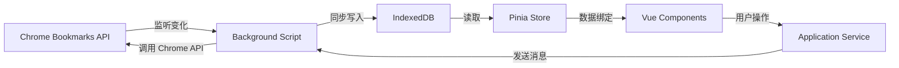

# AcuityBookmarks - 完整产品文档 v3.0

> 📘 **文档目标**：为 AI 编程助手（Cursor/Copilot）提供完整的项目上下文，确保生成的代码符合项目架构和规范。
>
> 🎯 **最后更新**：2025-10-26  
> 📦 **项目版本**：v1.0  
> 🏗️ **架构版本**：v3.0（DDD + 单向数据流 + 现代技术栈）

---

## 📋 目录

- [第一部分：产品概述](#第一部分产品概述)
- [第二部分：技术架构](#第二部分技术架构)
- [第三部分：核心功能](#第三部分核心功能)
- [第四部分：开发规范](#第四部分开发规范)
- [第五部分：数据流设计](#第五部分数据流设计)
- [第六部分：存储方案](#第六部分存储方案)
- [第七部分：关键实现细节](#第七部分关键实现细节)
- [第八部分：测试与质量保障](#第八部分测试与质量保障)

---

## 第一部分：产品概述

### 1.1 产品定位

**AcuityBookmarks** 是一款基于 AI 技术的 Chrome 浏览器扩展，专为解决书签混乱、查找困难等问题而设计。

#### 核心价值主张

- **智能化管理**：AI 驱动的书签自动分类和内容理解
- **高性能**：支持 2 万+ 书签的流畅管理
- **本地优先**：核心功能离线可用，隐私安全
- **现代化架构**：采用 DDD + 单向数据流 + 现代前端技术栈

### 1.2 目标用户

- **知识工作者**：研究员、学者、咨询师
- **内容创作者**：博主、记者、设计师
- **重度网络用户**：IT 从业者、产品经理
- **学生群体**：需要整理学习资料的在校学生

### 1.3 核心功能

#### 1.3.1 书签可视化管理

- **双面板布局**：左侧原始结构，右侧编辑后结构
- **拖拽重组**：支持书签和文件夹的直观拖拽移动
- **虚拟滚动**：基于 `@tanstack/vue-virtual`，支持大量书签流畅渲染

#### 1.3.2 智能搜索

- **多模式搜索**：关键词、语义、内容全文搜索
- **实时高亮**：搜索结果关键词高亮
- **搜索历史**：记录搜索历史，支持快速重复搜索

#### 1.3.3 书签健康扫描

- **死链检测**：自动检测失效书签
- **重复检测**：识别重复收藏
- **健康标签**：为书签添加健康状态标记

#### 1.3.4 AI 智能分类

- **内容爬取**：自动获取书签网页内容
- **LLM 分析**：利用大语言模型理解网页语义
- **自动归类**：智能推荐书签分类位置

---

## 第二部分：技术架构

### 2.1 技术栈概览

#### 2.1.1 前端技术栈

```typescript
{
  // 🔷 核心框架
  vue: "3.5.18",                    // 响应式框架
  pinia: "3.0.3",                   // 状态管理
  typescript: "5.8.3",              // 类型安全
  vite: "7.1.2",                    // 构建工具

  // 🔷 现代库（v3.0 新增）
  "@tanstack/vue-query": "5.90.5",  // 异步状态管理
  "@tanstack/vue-virtual": "3.13.12", // 虚拟滚动
  "@vueuse/core": "14.0.0",         // Vue Composables 工具集
  "immer": "10.2.0",                // 不可变状态更新
  "mitt": "3.0.1",                  // 事件总线
  "zod": "3.25.8",                  // 运行时数据校验

  // 🔷 搜索与工具
  "fuse.js": "6.6.2",               // 模糊搜索引擎
  "p-queue": "8.0.1",               // 并发控制

  // 🔷 测试框架
  "vitest": "2.1.1",                // 单元测试
  "@testing-library/vue": "8.1.0"   // 组件测试
}
```

#### 2.1.2 后端技术栈

```typescript
{
  // Cloudflare Workers
  runtime: "Bun 1.2.21+",           // 高性能 JavaScript 运行时
  platform: "Cloudflare Workers",   // Serverless 平台
  ai: "Cloudflare AI (Workers AI)", // LLM 推理
  database: "Cloudflare D1"         // SQLite 数据库
}
```

#### 2.1.3 Chrome Extension

```json
{
  "manifest_version": 3,
  "minimum_chrome_version": "100",
  "service_worker": "background.js" // Manifest V3
}
```

### 2.2 DDD 分层架构

AcuityBookmarks 严格遵循 **领域驱动设计（DDD）** 的分层架构：

```
frontend/src/
├── presentation/         # 表现层（UI 组件）
│   ├── pages/           # 页面级组件
│   └── components/      # 可复用组件
│
├── application/         # 应用层（业务流程协调）
│   ├── bookmark/        # 书签相关应用服务
│   ├── search/          # 搜索应用服务
│   ├── cleanup/         # 清理应用服务
│   └── settings/        # 设置应用服务
│
├── core/                # 核心层（领域逻辑）
│   ├── bookmark/        # 书签领域模型
│   │   ├── domain/      # 领域实体和值对象
│   │   ├── repositories/ # 仓储接口
│   │   └── services/    # 领域服务
│   └── search/          # 搜索领域逻辑
│
├── infrastructure/      # 基础设施层（技术实现）
│   ├── indexeddb/       # IndexedDB 管理
│   ├── storage/         # Chrome Storage API
│   ├── events/          # 事件总线（mitt）
│   ├── query/           # TanStack Query 配置
│   ├── state/           # Immer 状态更新工具
│   └── logging/         # 日志系统
│
├── background/          # 后台脚本（Chrome Extension）
│   ├── bookmarks.ts     # 书签变化监听
│   ├── messaging.ts     # 消息通信
│   ├── crawler-manager.ts # 爬虫管理器
│   └── state.ts         # 全局状态管理
│
├── stores/              # Pinia 状态管理
│   ├── bookmarkStore.ts      # 书签状态
│   ├── ui-store.ts           # UI 状态
│   ├── search/               # 搜索状态
│   └── cleanup/              # 清理状态
│
└── services/            # 服务层（跨层协调）
    ├── bookmark-sync-service.ts  # 书签同步服务
    ├── modern-bookmark-service.ts # 现代书签服务
    ├── bookmark-trait-service.ts # 书签特征计算服务
    └── trait-detection-service.ts # 特征检测 Worker 服务
```

#### 分层职责与规则

| 层级               | 职责                        | 禁止                                    |
| ------------------ | --------------------------- | --------------------------------------- |
| **Presentation**   | UI 渲染、用户交互、事件绑定 | 直接访问 Chrome API、直接访问 IndexedDB |
| **Application**    | 业务流程协调、跨领域编排    | 包含 UI 逻辑、直接操作 DOM              |
| **Core**           | 领域模型、业务规则、纯函数  | 依赖外部 API、依赖框架                  |
| **Infrastructure** | 技术实现、外部 API 封装     | 包含业务逻辑                            |

### 2.3 单向数据流架构

**🚨 架构核心原则**：IndexedDB 是整个系统的**唯一数据源**。



#### 数据流规则

1. **Chrome API → Background Script**
   - 🟢 Background Script 是唯一监听 `chrome.bookmarks.on*` 事件的地方
   - 🟢 所有 Chrome API 的 CRUD 操作必须通过 Background Script

2. **Background Script → IndexedDB**
   - 🟢 Background Script 负责将 Chrome 书签数据同步到 IndexedDB
   - 🟢 支持全量同步（`syncAllBookmarks`）和增量同步（`syncIncremental`）

3. **IndexedDB → UI**
   - 🟢 前端页面从 IndexedDB 读取数据
   - 🔴 禁止前端页面直接读取 Chrome API

4. **UI → Background Script**
   - 🟢 前端通过 `chrome.runtime.sendMessage` 发送 CRUD 请求
   - 🟢 Background Script 执行 Chrome API 操作后自动触发同步

#### 数据同步机制

```typescript
// 示例：Background Script 监听书签创建事件
chrome.bookmarks.onCreated.addListener(async (id, bookmark) => {
  logger.info('书签已创建:', bookmark.title)

  // 1. 增量同步到 IndexedDB
  await bookmarkSyncService.syncIncremental('created', id)

  // 2. 广播消息到所有前端页面
  chrome.runtime.sendMessage({
    type: 'acuity-bookmarks-db-synced',
    eventType: 'created',
    bookmarkId: id,
    timestamp: Date.now()
  })
})
```

### 2.4 构建与部署

#### 2.4.1 开发环境

```bash
# 安装依赖
bun install

# 前端开发（热更新）
bun run dev:frontend

# 前端构建（带热重载）
bun run build:hot

# 类型检查
bun run typecheck:force
```

#### 2.4.2 代码质量

```bash
# ESLint 检查与修复
bun run lint:fix:enhanced

# Stylelint 检查与修复
bun run stylelint:fix:enhanced

# 格式化代码
bun run format
```

---

## 第三部分：核心功能

### 3.1 书签管理（Management Page）

#### 3.1.1 双面板对比视图

**页面路径**：`frontend/src/pages/management/Management.vue`

- **左侧面板**：原始书签结构（`SimpleBookmarkTree`）
- **右侧面板**：编辑后结构（`SimpleBookmarkTree`）
- **数据源**：统一从 IndexedDB 加载

```typescript
// Management.vue 关键逻辑
const managementStore = useBookmarkManagementStore()

onMounted(async () => {
  // 初始化：从 IndexedDB 加载数据
  await managementStore.initialize()

  // 监听数据同步事件（通过 mitt 事件总线）
  const unsubscribeDbSynced = onEvent('data:synced', handleDbSynced)

  onUnmounted(() => {
    unsubscribeDbSynced()
  })
})
```

#### 3.1.2 虚拟滚动

**组件路径**：`frontend/src/components/composite/SimpleBookmarkTree/SimpleBookmarkTree.vue`

使用 `@tanstack/vue-virtual` 实现虚拟滚动：

```vue
<script setup lang="ts">
import { useVirtualizer } from '@tanstack/vue-virtual'

const virtualizer = useVirtualizer({
  count: flattenedNodes.value.length,
  getScrollElement: () => scrollContainerRef.value,
  estimateSize: () => 32, // 每个节点高度 32px
  overscan: 10 // 预渲染 10 个节点
})
</script>
```

#### 3.1.3 拖拽重组

支持书签和文件夹的拖拽移动：

- **拖拽库**：原生 HTML5 Drag & Drop API
- **限制**：只能在同一面板内拖拽，不支持跨面板
- **数据更新**：拖拽完成后通过 Application Service 发送消息到 Background Script

### 3.2 智能搜索

#### 3.2.1 搜索架构

**核心文件**：`frontend/src/core/search/unified-search-service.ts`

支持三种搜索模式：

1. **关键词搜索**：基于 IndexedDB 索引的精确匹配
2. **模糊搜索**：基于 Fuse.js 的模糊匹配
3. **语义搜索**：基于 LLM 的语义理解（需要后端支持）

```typescript
// 搜索流程
class UnifiedSearchService {
  async search(query: string, options: SearchOptions) {
    // 1. 从 IndexedDB 获取候选结果
    const candidates = await indexedDBManager.searchBookmarks(query, options)

    // 2. 如果启用模糊搜索，使用 Fuse.js 再次过滤
    if (options.fuzzyMatch) {
      return this.fuseSearch(candidates, query)
    }

    // 3. 返回结果
    return candidates
  }
}
```

#### 3.2.2 搜索性能优化

- **索引优化**：IndexedDB 中为 `titleLower`、`urlLower`、`domain`、`keywords`、`tags` 建立索引
- **结果缓存**：使用 `query-cache.ts` 缓存搜索结果
- **防抖**：使用 VueUse 的 `useDebounceFn` 防抖用户输入

### 3.3 书签特征检测

#### 3.3.1 特征标签系统

**核心文件**：`frontend/src/services/bookmark-trait-service.ts`

支持的特征标签：

- `invalid`：失效书签（HTTP 404/500 或无效 URL）
- `duplicate`：重复 URL
- `internal`：浏览器内部链接（chrome://、file:// 等）

```typescript
// 特征检测流程
async function evaluateBookmarkTraits(bookmarkId: string) {
  const bookmark = await indexedDBManager.getBookmarkById(bookmarkId)
  if (!bookmark?.url) return

  const traitTags: string[] = []

  // 1. 检查是否为浏览器内部协议
  if (isInternalProtocol(bookmark.url)) {
    traitTags.push('internal')
  }
  // 2. 对于非内部协议的书签，进行进一步检查
  else {
    // 2.1 URL格式检测
    if (!isValidBookmarkUrl(bookmark.url)) {
      traitTags.push('invalid')
    }
    // 2.2 HTTP错误检测
    else {
      const crawlMetadata = await indexedDBManager.getCrawlMetadata(bookmarkId)
      if (crawlMetadata && isHttpFailure(crawlMetadata)) {
        traitTags.push('invalid')
      }
    }
  }

  // 3. 重复书签检测
  const duplicates = await indexedDBManager.getBookmarksByUrl(bookmark.url)
  if (duplicates.length > 1) {
    traitTags.push('duplicate')
  }

  // 4. 更新特征标签到 IndexedDB
  await indexedDBManager.updateBookmarksTraits([
    {
      id: bookmarkId,
      traitTags,
      traitMetadata: traitTags.map(tag => ({
        tag,
        detectedAt: Date.now(),
        source: 'worker'
      }))
    }
  ])
}
```

### 3.4 本地化爬取

#### 3.4.1 爬取架构

**核心文件**：`frontend/src/services/local-bookmark-crawler.ts`

- **爬取方式**：通过 `fetch` API 直接请求书签 URL
- **并发控制**：使用 `p-queue` 限制并发数（默认 5）
- **数据存储**：爬取元数据存储在 IndexedDB 的 `crawl_metadata` 表

```typescript
class LocalBookmarkCrawler {
  private queue = new PQueue({ concurrency: 5 })

  async crawlBookmark(bookmarkId: string, url: string) {
    return this.queue.add(async () => {
      try {
        const response = await fetch(url, { method: 'HEAD' })

        // 存储爬取元数据
        await indexedDBManager.saveCrawlMetadata({
          bookmarkId,
          url,
          httpStatus: response.status,
          lastCrawled: Date.now()
        })
      } catch (error) {
        logger.error('爬取失败', { bookmarkId, url, error })
      }
    })
  }
}
```

---

## 第四部分：开发规范

### 4.1 代码规范

#### 4.1.1 TypeScript 规范

- ✅ **禁止使用 `any`**：所有类型必须明确声明
- ✅ **使用 Zod 进行运行时校验**：对外部数据（IndexedDB、Chrome API）进行校验
- ✅ **JSDoc 注释**：所有公开函数和类必须有中文 JSDoc 注释

```typescript
/**
 * 从 IndexedDB 加载所有书签
 *
 * @returns 书签节点数组
 * @throws {Error} 如果数据库未初始化
 */
async function loadAllBookmarks(): Promise<BookmarkNode[]> {
  const records = await indexedDBManager.getAllBookmarks()
  return BookmarkRecordArraySchema.parse(records)
}
```

#### 4.1.2 Vue 组件规范

- ✅ **使用 `<script setup>` + Composition API**
- ✅ **组件命名使用 PascalCase**：`SimpleBookmarkTree.vue`
- ✅ **导出组件名**：`defineOptions({ name: "SimpleBookmarkTree" })`

```vue
<script setup lang="ts">
import { defineOptions } from 'vue'

defineOptions({
  name: 'SimpleBookmarkTree'
})

// 组件逻辑
</script>
```

#### 4.1.3 Pinia Store 规范

- ✅ **使用 Composition API 风格**：`const store = defineStore('name', () => { ... })`
- ✅ **使用 Immer 更新复杂状态**：`updateMap(nodes.value, draft => { ... })`
- ✅ **明确导出 API**：在 `return` 中明确导出哪些状态和方法

```typescript
export const useBookmarkStore = defineStore('bookmarks', () => {
  const nodes = ref<Map<string, BookmarkNode>>(new Map())

  function addNode(node: BookmarkNode) {
    updateMap(nodes.value, draft => {
      draft.set(node.id, node)
    })
  }

  return {
    // State
    nodes: readonly(nodes),
    // Actions
    addNode
  }
})
```

### 4.2 文件组织规范

#### 4.2.1 组件目录结构

```
components/
├── base/              # 基础组件（Button, Input, Dialog）
│   ├── Button/
│   │   ├── Button.vue
│   │   ├── Button.d.ts       # TypeScript 类型定义
│   │   └── Button.README.md  # 组件文档
│   └── ...
└── composite/         # 复合组件（业务组件）
    ├── SimpleBookmarkTree/
    └── ...
```

#### 4.2.2 类型定义文件

所有类型定义集中在 `frontend/src/types/` 目录：

```
types/
├── domain/            # 领域模型类型
│   ├── bookmark.ts
│   └── search.ts
├── application/       # 应用层类型
├── infrastructure/    # 基础设施层类型
└── index.ts           # 统一导出
```

### 4.3 Git 提交规范

遵循 [Conventional Commits](https://www.conventionalcommits.org/) 规范：

```bash
# 格式
<type>(<scope>): <subject>

# 示例
feat(search): 添加语义搜索功能
fix(store): 修复书签树无限递归问题
refactor(indexeddb): 使用 Immer 简化状态更新
docs(readme): 更新安装说明
```

**Type 类型**：

- `feat`：新功能
- `fix`：Bug 修复
- `refactor`：代码重构
- `docs`：文档更新
- `style`：代码格式调整
- `test`：测试相关
- `chore`：构建/工具链相关

---

## 第五部分：数据流设计

### 5.1 单向数据流详解

#### 5.1.1 完整数据流图

```
[用户操作 UI]
      ↓
[Vue Component]
      ↓
[Application Service] ────发送消息───→ [Background Script]
                                              ↓
                                      [调用 Chrome API]
                                              ↓
                                      [Chrome Bookmarks]
                                              ↓
                                  [触发 chrome.bookmarks.on* 事件]
                                              ↓
                                  [Background Script 监听器]
                                              ↓
                              [同步到 IndexedDB（全量/增量）]
                                              ↓
                              [广播消息到所有前端页面]
                                              ↓
                                  [前端监听 mitt 事件]
                                              ↓
                              [从 IndexedDB 刷新数据]
                                              ↓
                                  [更新 Pinia Store]
                                              ↓
                                  [Vue 响应式更新 UI]
```

#### 5.1.2 CRUD 操作流程

##### 创建书签

```typescript
// 1. 前端发起请求
async function createBookmark(parentId: string, title: string, url: string) {
  await chrome.runtime.sendMessage({
    type: 'CREATE_BOOKMARK',
    parentId,
    title,
    url
  })
}

// 2. Background Script 处理
chrome.runtime.onMessage.addListener((message, sender, sendResponse) => {
  if (message.type === 'CREATE_BOOKMARK') {
    chrome.bookmarks.create({
      parentId: message.parentId,
      title: message.title,
      url: message.url
    })
    // 注意：不需要手动同步，chrome.bookmarks.onCreated 会自动触发
  }
})

// 3. chrome.bookmarks.onCreated 自动触发同步
chrome.bookmarks.onCreated.addListener(async (id, bookmark) => {
  await bookmarkSyncService.syncIncremental('created', id)
  chrome.runtime.sendMessage({
    type: 'acuity-bookmarks-db-synced',
    eventType: 'created',
    bookmarkId: id
  })
})

// 4. 前端监听同步消息
onEvent('data:synced', async data => {
  if (data.eventType === 'created') {
    await bookmarkStore.loadFromIndexedDB()
  }
})
```

##### 更新书签

```typescript
// 前端 → Background → Chrome API → onChanged → 同步 → 前端刷新
```

##### 删除书签

```typescript
// 前端 → Background → Chrome API → onRemoved → 同步 → 前端刷新
```

#### 5.1.3 增量同步 vs 全量同步

| 同步方式     | 触发时机                         | 性能                 | 数据完整性                |
| ------------ | -------------------------------- | -------------------- | ------------------------- |
| **增量同步** | 单个书签的 CRUD 操作             | 高（只更新单个节点） | 中（依赖 pathIds 正确性） |
| **全量同步** | 书签导入、移动操作、数据健康检查 | 低（重建整个树）     | 高（完全一致）            |

```typescript
// 增量同步
await bookmarkSyncService.syncIncremental('created', bookmarkId)

// 全量同步
await bookmarkSyncService.syncAllBookmarks()
```

### 5.2 事件系统（mitt）

#### 5.2.1 事件定义

**文件路径**：`frontend/src/infrastructure/events/event-bus.ts`

```typescript
export interface AppEvents {
  'bookmark:created': { id: string; bookmark: BookmarkNode }
  'bookmark:updated': { id: string; changes: Partial<BookmarkNode> }
  'bookmark:deleted': { id: string }
  'data:synced': { eventType: string; bookmarkId: string; timestamp: number }
  'sync:started': { source: 'background' | 'user' | 'auto' }
  'sync:completed': { duration: number; count: number }
}
```

#### 5.2.2 事件使用

```typescript
// 发送事件
emitEvent('bookmark:created', { id: '123', bookmark: { ... } })

// 监听事件
const unsubscribe = onEvent('bookmark:created', (data) => {
  console.log('书签创建:', data.id)
})

// 取消监听
unsubscribe()
```

### 5.3 Chrome 消息桥接

**文件路径**：`frontend/src/infrastructure/events/chrome-message-bridge.ts`

负责将 Chrome Runtime 消息转换为 mitt 事件：

```typescript
export function initializeChromeMessageBridge() {
  chrome.runtime.onMessage.addListener(message => {
    if (message.type === 'acuity-bookmarks-db-synced') {
      // 将 Chrome 消息转换为 mitt 事件
      emitEvent('data:synced', {
        eventType: message.eventType,
        bookmarkId: message.bookmarkId,
        timestamp: message.timestamp
      })
    }
  })
}
```

---

## 第六部分：存储方案

### 6.1 存储层级划分

AcuityBookmarks 使用 **四层存储架构**，每层有明确的职责：

| 存储类型                   | 生命周期                   | 容量限制           | 使用场景                                    | Chrome 版本要求 |
| -------------------------- | -------------------------- | ------------------ | ------------------------------------------- | --------------- |
| **IndexedDB**              | 永久（除非用户清除）       | 可用磁盘空间的 60% | 大量书签数据（2 万+）、爬取元数据、搜索历史 | 所有版本        |
| **chrome.storage.local**   | 永久                       | 10 MB              | 用户偏好设置、扩展配置、持久化状态          | 所有版本        |
| **chrome.storage.session** | 会话级（浏览器关闭后清除） | 10 MB              | 临时数据、UI 状态、未保存表单、搜索历史     | Chrome 102+     |
| **Pinia Store**            | 页面级（页面刷新后清除）   | 内存               | 高频 UI 状态、计算属性、临时缓存            | N/A             |

### 6.2 IndexedDB 设计

#### 6.2.1 数据库结构

**数据库名称**：`AcuityBookmarksDB`  
**版本号**：`11`

**对象存储（Object Stores）**：

```typescript
{
  // 1. 书签数据表（主表）
  bookmarks: {
    keyPath: 'id',
    indexes: [
      'parentId',           // 父节点 ID
      'url',                // URL
      'urlLower',           // URL（小写）
      'domain',             // 域名
      'titleLower',         // 标题（小写）
      'parentId_index',     // 复合索引（父节点 + 排序）
      'pathIds',            // 路径 ID 数组（multiEntry）
      'keywords',           // 关键词（multiEntry）
      'tags',               // 标签（multiEntry）
      'traitTags',          // 特征标签（multiEntry）
      'dateAdded'           // 添加时间
    ]
  },

  // 2. 全局统计表
  global_stats: {
    keyPath: 'key',
    indexes: ['key', 'updatedAt']
  },

  // 3. 设置表
  settings: {
    keyPath: 'key',
    indexes: ['updatedAt', 'type']
  },

  // 4. 搜索历史表
  search_history: {
    keyPath: 'id',
    autoIncrement: true,
    indexes: ['query', 'timestamp', 'source']
  },

  // 5. Favicon 缓存表
  favicon_cache: {
    keyPath: 'domain',
    indexes: ['timestamp', 'lastAccessed', 'bookmarkCount']
  },

  // 6. 爬取元数据表
  crawl_metadata: {
    keyPath: 'bookmarkId',
    indexes: ['domain', 'httpStatus', 'lastCrawled']
  },

  // 7. 向量嵌入表（AI 功能）
  embeddings: {
    keyPath: 'bookmarkId',
    indexes: ['domain', 'updatedAt']
  },

  // 8. AI 任务表
  ai_jobs: {
    keyPath: 'id',
    indexes: ['status', 'type', 'createdAt']
  }
}
```

#### 6.2.2 BookmarkRecord 数据结构

```typescript
interface BookmarkRecord {
  // 基础字段（来自 Chrome API）
  id: string
  title: string
  url?: string
  parentId?: string
  index?: number
  dateAdded?: number
  dateGroupModified?: number

  // 增强字段（自定义）
  titleLower: string // 标题小写（用于搜索）
  urlLower?: string // URL 小写（用于搜索）
  domain?: string // 域名（提取自 URL）
  pathIds: string[] // 路径 ID 数组（从根到当前节点）
  keywords: string[] // 关键词（提取自标题和 URL）
  tags: string[] // 用户自定义标签

  // 特征相关
  traitTags: string[] // 特征标签（duplicate, invalid, internal）
  traitMetadata: Array<{
    tag: string
    detectedAt: number
    source: 'worker' | 'manual'
    notes?: string
  }>

  // 统计信息
  visitCount?: number // 访问次数
  lastVisited?: number // 最后访问时间
}
```

#### 6.2.3 IndexedDB 性能优化

**针对 2 万书签的优化**：

1. **批量操作**：使用 `runBatchOperation` 分批写入（默认 2000/批）
2. **索引优化**：为常用查询字段建立索引
3. **缓存树结构**：`bookmarkStore` 中缓存计算好的树结构
4. **递归扁平化**：使用 `flattenTreeToMap` 将树结构扁平化为 Map

```typescript
// 性能对比（2 万书签）
操作                 | 优化前   | 优化后   | 提升
---------------------|---------|---------|------
初次加载             | 5-8s    | 1-2s    | 4-5x
树结构计算           | 800ms   | <50ms   | 16x
节点查找（Map）      | O(n)    | O(1)    | 2万x
```

### 6.3 chrome.storage 使用

#### 6.3.1 chrome.storage.session（临时数据）

**文件路径**：`frontend/src/infrastructure/storage/modern-storage.ts`

```typescript
// 1. 数据库就绪状态（会话级）
await modernStorage.setSession('AB_DB_READY', true)

// 2. 同步状态（防止重复同步）
await modernStorage.setSession('SYNC_STATE', { isSyncing: true })

// 3. 爬取任务状态
await modernStorage.setSession('CRAWL_RUNNING', true)

// 4. UI 状态（展开的文件夹）
await modernStorage.setSession('ORIGINAL_EXPANDED', new Set(['1', '2']))

// 5. 搜索历史（会话级）
await modernStorage.setSession('SEARCH_HISTORY', ['query1', 'query2'])

// 6. 未保存的编辑草稿
await modernStorage.setSession('EDIT_BOOKMARK_DRAFT', {
  id: '123',
  title: '新标题'
})
```

#### 6.3.2 chrome.storage.local（持久化数据）

```typescript
// 1. 用户偏好设置
await modernStorage.setLocal('USER_PREFERENCES', {
  theme: 'dark',
  language: 'zh-CN'
})

// 2. 扩展配置
await modernStorage.setLocal('EXTENSION_CONFIG', {
  apiEndpoint: 'https://api.acuitybookmarks.com',
  enableAI: true
})

// 3. 搜索设置
await modernStorage.setLocal('SEARCH_SETTINGS', {
  fuzzyMatch: true,
  maxResults: 100
})

// 4. 清理过滤器（持久化）
await modernStorage.setLocal('ACTIVE_FILTERS', ['DEAD_LINK'])
```

### 6.4 Pinia Store（内存状态）

**适用场景**：

- ✅ 高频更新的 UI 状态（选中项、悬停状态）
- ✅ 计算属性（虚拟滚动的扁平化节点列表）
- ✅ 临时缓存（避免重复计算）

```typescript
// 示例：bookmarkStore
export const useBookmarkStore = defineStore('bookmarks', () => {
  // 内存中的节点映射（从 IndexedDB 加载后缓存）
  const nodes = ref<Map<string, BookmarkNode>>(new Map())

  // 计算属性（自动响应式）
  const bookmarkTree = computed(() => buildTreeFromNodes(nodes.value))

  return { nodes, bookmarkTree }
})
```

---

## 第七部分：关键实现细节

### 7.1 Immer 集成

**文件路径**：`frontend/src/infrastructure/state/immer-helpers.ts`

Immer 用于简化不可变状态更新：

```typescript
import { produce } from 'immer'

/**
 * 更新 Vue Ref 包装的 Map
 */
export function updateMap<K, V>(
  mapRef: Ref<Map<K, V>>,
  updater: (draft: Map<K, V>) => void
): void {
  mapRef.value = produce(mapRef.value, updater)
}

/**
 * 更新 Vue Ref 包装的数组
 */
export function updateArray<T>(
  arrayRef: Ref<T[]>,
  updater: (draft: T[]) => void
): void {
  arrayRef.value = produce(arrayRef.value, updater)
}

// 使用示例
const nodes = ref(new Map<string, BookmarkNode>())

updateMap(nodes, draft => {
  draft.set('123', { id: '123', title: '新书签' })
  draft.delete('456')
})
```

### 7.2 TanStack Query 集成

**文件路径**：`frontend/src/infrastructure/query/query-client.ts`

TanStack Query 用于管理异步数据获取和缓存：

```typescript
import { QueryClient } from '@tanstack/vue-query'

export const queryClient = new QueryClient({
  defaultOptions: {
    queries: {
      staleTime: 5 * 60 * 1000, // 5 分钟缓存
      cacheTime: 10 * 60 * 1000, // 10 分钟后清除
      refetchOnWindowFocus: false,
      retry: 1
    }
  }
})
```

**Composable 使用**：

```typescript
// frontend/src/composables/useBookmarkQueries.ts
import { useQuery } from '@tanstack/vue-query'

export function useBookmarkQuery(bookmarkId: string) {
  return useQuery({
    queryKey: ['bookmark', bookmarkId],
    queryFn: async () => {
      return await indexedDBManager.getBookmarkById(bookmarkId)
    },
    staleTime: 5 * 60 * 1000
  })
}
```

### 7.3 VueUse 实用工具

**常用 VueUse Composables**：

```typescript
import {
  useEventListener, // 自动清理的事件监听
  useDebounceFn, // 防抖函数
  useTimeoutFn, // 自动清理的 setTimeout
  useStorage, // localStorage 响应式包装
  useToggle, // 布尔值切换
  useMouse, // 鼠标位置跟踪
  useIntersectionObserver // 元素可见性检测
} from '@vueuse/core'

// 示例：防抖搜索
const debouncedSearch = useDebounceFn(async (query: string) => {
  await searchService.search(query)
}, 300)
```

### 7.4 Zod 数据校验

**文件路径**：`frontend/src/infrastructure/indexeddb/validation/records.ts`

所有从 IndexedDB 读取的数据都需要通过 Zod 校验：

```typescript
import { z } from 'zod'

export const BookmarkRecordSchema = z.object({
  id: z.string(),
  title: z.string(),
  url: z.string().url().optional(),
  parentId: z.string().optional(),
  index: z.number().optional(),
  titleLower: z.string(),
  pathIds: z.array(z.string()).default([]),
  keywords: z.array(z.string()).default([]),
  tags: z.array(z.string()).default([]),
  traitTags: z.array(z.string()).default([]),
  traitMetadata: z
    .array(
      z.object({
        tag: z.string(),
        detectedAt: z.number(),
        source: z.enum(['worker', 'manual']),
        notes: z.string().optional()
      })
    )
    .default([])
})

// 使用
const records = await indexedDBManager.getAllBookmarks()
const validated = BookmarkRecordArraySchema.parse(records)
```

### 7.5 性能监控

**文件路径**：`frontend/src/components/base/PerformanceMonitor/PerformanceMonitor.vue`

开发模式下自动监控性能指标：

```typescript
// 监控指标
interface PerformanceMetrics {
  // 页面加载
  domContentLoaded: number
  windowLoad: number

  // 渲染性能
  firstPaint: number
  firstContentfulPaint: number
  largestContentfulPaint: number

  // 交互性能
  firstInputDelay: number
  totalBlockingTime: number

  // 自定义指标
  bookmarkTreeBuildTime: number
  indexedDBQueryTime: number
}
```

### 7.6 长耗时任务设计原则

> 🎯 **设计哲学**：真实进度 > 假进度 > 无反馈

#### 7.6.1 核心设计原则

##### 原则 1：业务优先级决定执行策略

```typescript
🔴 核心业务（同步执行 + 真实进度）
  - 用户必须等待才能继续操作
  - 阻塞主线程，但提供清晰的进度反馈
  - 告诉用户："在做什么"、"进度多少"、"还要多久"

🟡 辅助业务（Worker 异步 + 后台执行）
  - 不影响核心书签操作
  - 可以在后台慢慢执行
  - 失败不影响主要功能
```

##### 原则 2：真实进度反馈优于假装流畅

```typescript
✅ 真实进度：50% → 用户知道还要等多久 → 用户体验好
⚠️ 假进度：转圈圈 → 用户焦虑但能接受 → 用户体验一般
❌ 无反馈：页面冻结 → 用户以为崩溃了 → 用户体验差
```

**理由**：

- 如果数据没有完全录入 IndexedDB，用户打开管理页面也做不了什么
- Worker 异步只是"假装流畅"，实际可操作时间不变
- 诚实的进度反馈 > 美好的假象

#### 7.6.2 业务分级与执行策略

##### 🔴 核心业务（必须同步执行 + 实时进度）

| 业务               | 耗时               | 优先级 | 执行策略        | 进度要求                 |
| ------------------ | ------------------ | ------ | --------------- | ------------------------ |
| 书签全量同步       | 1-2s (20,000 书签) | P0     | 同步 + 分批写入 | 阶段 + 百分比 + 预计时间 |
| 书签导入           | 2-5s (批量导入)    | P0     | 同步 + 分批写入 | 导入进度 + 剩余时间      |
| 初次数据加载       | 1-2s               | P0     | 同步            | 加载阶段 + 百分比        |
| 书签移动（优化后） | 50-100ms           | P0     | 同步            | 无需进度（瞬间完成）     |

**实现要求**：

```typescript
// 1. 进度数据结构
interface SyncProgress {
  phase: 'fetching' | 'converting' | 'writing' | 'indexing' | 'completed'
  current: number
  total: number
  percentage: number
  message: string
  estimatedRemaining?: number  // 预计剩余时间（ms）
}

// 2. 进度回调机制
type ProgressCallback = (progress: SyncProgress) => void

class BookmarkSyncService {
  private progressCallbacks: Set<ProgressCallback> = new Set()

  onProgress(callback: ProgressCallback): () => void {
    this.progressCallbacks.add(callback)
    return () => this.progressCallbacks.delete(callback)
  }

  private notifyProgress(progress: SyncProgress): void {
    this.progressCallbacks.forEach(cb => cb(progress))
  }
}

// 3. UI 组件要求
<SyncProgressDialog
  :show="syncProgress.show"
  :progress="syncProgress.data"
>
  <!-- 必须显示：-->
  <!-- - 当前阶段（fetching/converting/writing）-->
  <!-- - 进度百分比（43%）-->
  <!-- - 当前/总数（8,523 / 20,000）-->
  <!-- - 预计剩余时间（约 3 秒）-->
</SyncProgressDialog>
```

##### 🟡 辅助业务（Worker 异步 + 队列调度）

| 业务               | 耗时            | 优先级 | 执行策略          | 调度要求              |
| ------------------ | --------------- | ------ | ----------------- | --------------------- |
| 网页爬虫（元数据） | 按需，单个 2-5s | P1     | Worker + 队列     | 优先级排序 + 并发控制 |
| AI 标签分类        | 按需，单个 1-3s | P1     | Worker + 批处理   | 后台执行 + 可暂停     |
| 健康扫描           | 5-10s           | P2     | Worker + 后台执行 | 可取消 + 进度显示     |
| 全文搜索索引       | 3-5s            | P1     | Worker + 增量构建 | 后台构建              |

**实现要求**：

```typescript
// Worker 任务调度器
class WorkerTaskScheduler {
  private queue: WorkerTask[] = []
  private running = new Set<string>()
  private maxConcurrent = 2 // 同时最多 2 个任务

  enqueue(task: WorkerTask, onProgress?: ProgressCallback): void {
    this.queue.push(task)
    this.queue.sort((a, b) => b.priority - a.priority) // 优先级排序
    this.processNext()
  }

  pause(): void {
    this.paused = true
    this.worker?.postMessage({ type: 'pause' })
  }

  resume(): void {
    this.paused = false
    this.processNext()
  }

  cancel(taskId: string): void {
    this.queue = this.queue.filter(t => t.id !== taskId)
    if (this.running.has(taskId)) {
      this.worker?.postMessage({ type: 'cancel', taskId })
    }
  }
}
```

#### 7.6.3 进度条实现指南

##### UI 组件结构

```vue
<template>
  <Dialog persistent :hide-close="true">
    <!-- 1. 阶段指示器 -->
    <div class="phase-indicators">
      <div
        v-for="phase in phases"
        :class="{ active: isActive(phase), completed: isCompleted(phase) }"
      >
        <Icon :name="phase.icon" />
        <span>{{ phase.label }}</span>
      </div>
    </div>

    <!-- 2. 进度条 -->
    <div class="progress-bar">
      <div class="progress-fill" :style="{ width: `${percentage}%` }" />
    </div>

    <!-- 3. 详细信息 -->
    <div class="progress-details">
      <div class="progress-text">{{ message }}</div>
      <div class="progress-stats">
        <span class="percentage">{{ Math.round(percentage) }}%</span>
        <span class="count">{{ current }} / {{ total }}</span>
        <span class="time">剩余约 {{ formatTime(estimatedRemaining) }}</span>
      </div>
    </div>
  </Dialog>
</template>
```

##### 性能要求

- **初次加载**：< 2s
- **全量同步**：< 2s（20,000 书签）
- **单书签操作**：< 50ms（增量更新）
- **进度更新频率**：每 100 个节点报告一次
- **UI 响应性**：每批次后 `setTimeout(0)` 让出主线程

#### 7.6.4 架构决策理由

##### 为什么核心业务不用 Worker？

```typescript
问题：如果 IndexedDB 没有完整数据
  ↓
Management 页面无法展示书签树
  ↓
用户无法进行任何有意义的操作
  ↓
Worker 异步带来的"UI 流畅度"毫无价值
```

**结论**：

- ✅ 数据完整性 > UI 响应性
- ✅ 真实进度反馈 > 假装不阻塞
- ✅ 分批写入 + `setTimeout(0)` = 既有进度又不"冻结"

##### 为什么辅助业务用 Worker？

```typescript
场景：用户正在 Management 页面编辑书签
  ↓
后台触发健康扫描（5-10s）
  ↓
【不用 Worker】主线程阻塞 → 页面冻结 → 用户无法操作
【使用 Worker】主线程不阻塞 → 可以继续编辑 → 后台慢慢扫描
```

**结论**：

- ✅ 不影响核心操作是关键
- ✅ 失败也不影响主要功能
- ✅ 可以提供"取消"、"暂停"选项

#### 7.6.5 当前实现状态

##### ✅ 已符合原则

- 爬虫系统使用 Offscreen Document（不阻塞主线程）
- Management 页面有 loading 状态（`isPageLoading`）
- 健康扫描有独立 loading 状态（`isCleanupLoading`）
- 书签同步采用增量 + 全量混合策略

##### ❌ 需要改进

1. **书签全量同步缺少真实进度**
   - 当前：只有转圈圈
   - 期望：阶段指示（读取 → 转换 → 写入）+ 百分比（43%）+ 预计时间（约 3 秒）

2. **特征检测支持 Worker 异步执行**
   - 当前：`bookmark-trait-service.ts` 提供同步和异步两种模式
   - 已实现：`trait-detection-service.ts` 提供 Worker 异步检测，支持进度反馈和取消操作

3. **缺少进度组件**
   - 当前：静态 Loading 文本
   - 期望：通用的 `SyncProgressDialog` 组件，复用于所有长耗时任务

---

## 第八部分：测试与质量保障

### 8.1 测试策略

#### 8.1.1 单元测试

**框架**：Vitest + @testing-library/vue

```typescript
// 示例：测试 Immer 工具函数
import { describe, it, expect } from 'vitest'
import { updateMap } from '@/infrastructure/state/immer-helpers'

describe('updateMap', () => {
  it('should update map immutably', () => {
    const mapRef = ref(new Map([['a', 1]]))
    const oldMap = mapRef.value

    updateMap(mapRef, draft => {
      draft.set('b', 2)
    })

    expect(mapRef.value).not.toBe(oldMap) // 不可变
    expect(mapRef.value.get('b')).toBe(2) // 更新成功
  })
})
```

#### 8.1.2 组件测试

```typescript
import { mount } from '@vue/test-utils'
import { describe, it, expect } from 'vitest'
import Button from '@/components/base/Button/Button.vue'

describe('Button', () => {
  it('should emit click event', async () => {
    const wrapper = mount(Button, {
      props: { label: 'Click me' }
    })

    await wrapper.trigger('click')
    expect(wrapper.emitted('click')).toBeTruthy()
  })
})
```

#### 8.1.3 E2E 测试

**工具**：Puppeteer

```bash
# 运行 E2E 测试
bun run e2e:management --ext $EXT_ID
```

### 8.2 代码质量工具

#### 8.2.1 ESLint

```bash
# 检查代码
bun run lint:check

# 自动修复
bun run lint:fix:enhanced
```

#### 8.2.2 Stylelint

```bash
# 检查 CSS
bun run stylelint

# 自动修复
bun run stylelint:fix:enhanced
```

#### 8.2.3 TypeScript

```bash
# 类型检查
bun run typecheck:force
```

#### 8.2.4 Prettier

```bash
# 格式化代码
bun run format
```

### 8.3 性能审计

#### 8.3.1 Lighthouse CI

```bash
# 运行 Lighthouse 审计
bun run audit:lhci

# 查看审计报告
bun run audit:lhci:summary
```

### 8.4 Git Hooks

使用 Husky 在提交前自动检查：

```bash
# .husky/pre-commit
bun run lint:fix:enhanced
bun run typecheck:force
```

---

## 附录 A：常用命令速查表

```bash
# ========== 开发 ==========
bun install                     # 安装依赖
bun run dev:frontend            # 前端开发服务器
bun run build:hot               # 前端热构建（推荐）
bun run build:hot:no-lint       # 跳过 ESLint 的热构建

# ========== 构建 ==========
bun run build:frontend          # 前端构建（开发模式）
bun run build:frontend:fast     # 前端构建（生产模式）
bun run build:frontend:analyze  # 分析构建体积

# ========== 代码质量 ==========
bun run typecheck:force         # 类型检查（强制）
bun run lint:fix:enhanced       # ESLint 自动修复
bun run stylelint:fix:enhanced  # Stylelint 自动修复
bun run format                  # Prettier 格式化

# ========== 测试 ==========
bun run test                    # 运行所有测试
bun run test:coverage           # 生成覆盖率报告
bun run e2e:management          # E2E 测试

# ========== 审计 ==========
bun run audit:lhci              # Lighthouse 审计
bun run audit:lhci:summary      # 审计报告摘要
```

---

## 附录 B：关键文件路径速查表

| 功能             | 文件路径                                                |
| ---------------- | ------------------------------------------------------- |
| **架构文档**     |                                                         |
| 单向数据流说明   | `/单向数据流架构说明.md`                                |
| **前端核心**     |                                                         |
| 书签 Store       | `frontend/src/stores/bookmarkStore.ts`                  |
| 管理页面         | `frontend/src/pages/management/Management.vue`          |
| 书签树组件       | `frontend/src/components/composite/SimpleBookmarkTree/` |
| **基础设施**     |                                                         |
| IndexedDB 管理器 | `frontend/src/infrastructure/indexeddb/manager.ts`      |
| 存储抽象层       | `frontend/src/infrastructure/storage/modern-storage.ts` |
| 事件总线         | `frontend/src/infrastructure/events/event-bus.ts`       |
| Immer 工具       | `frontend/src/infrastructure/state/immer-helpers.ts`    |
| **后台脚本**     |                                                         |
| 书签监听         | `frontend/src/background/bookmarks.ts`                  |
| 消息处理         | `frontend/src/background/messaging.ts`                  |
| 爬虫管理器       | `frontend/src/background/crawler-manager.ts`            |
| **服务层**       |                                                         |
| 书签同步服务     | `frontend/src/services/bookmark-sync-service.ts`        |
| 书签特征服务     | `frontend/src/services/bookmark-trait-service.ts`       |
| 特征检测服务     | `frontend/src/services/trait-detection-service.ts`      |
| 本地爬取服务     | `frontend/src/services/local-bookmark-crawler.ts`       |
| **配置文件**     |                                                         |
| Manifest         | `frontend/public/manifest.json`                         |
| Vite 配置        | `frontend/vite.config.ts`                               |
| TypeScript 配置  | `frontend/tsconfig.json`                                |
| ESLint 配置      | `eslint.config.js`                                      |
| Stylelint 配置   | `frontend/stylelint.config.js`                          |

---

## 附录 C：术语表

| 术语               | 解释                                                    |
| ------------------ | ------------------------------------------------------- |
| **DDD**            | Domain-Driven Design（领域驱动设计）                    |
| **单向数据流**     | Chrome API → Background → IndexedDB → UI 的单向数据流动 |
| **IndexedDB**      | 浏览器端的 NoSQL 数据库，本项目的唯一数据源             |
| **BookmarkRecord** | IndexedDB 中存储的书签数据结构                          |
| **BookmarkNode**   | 前端 Vue 组件使用的书签节点数据结构                     |
| **Pinia Store**    | Vue 的状态管理库                                        |
| **mitt**           | 轻量级事件总线库                                        |
| **Immer**          | 不可变状态更新库                                        |
| **TanStack Query** | 异步状态管理和缓存库                                    |
| **VueUse**         | Vue Composition API 实用工具集                          |
| **Zod**            | TypeScript 运行时数据校验库                             |
| **虚拟滚动**       | 只渲染可见区域的节点，提升大列表性能                    |
| **pathIds**        | 从根节点到当前节点的所有父节点 ID 数组                  |
| **traitTags**      | 书签特征标签（duplicate, invalid, internal）            |

---

## 附录 D：FAQ

### Q1: 为什么 IndexedDB 是唯一数据源？

**A**: 为了确保数据一致性和架构清晰性。Chrome API 只负责数据的持久化，IndexedDB 作为中间层提供：

- ✅ 更快的查询性能（索引支持）
- ✅ 离线能力
- ✅ 统一的数据访问接口
- ✅ 防止多个页面同时读取 Chrome API 导致的数据不一致

### Q2: 为什么使用 Immer？

**A**: Immer 简化了复杂数据结构的不可变更新，特别是 `Map` 和嵌套对象：

```typescript
// 不使用 Immer（繁琐）
const newNodes = new Map(nodes.value)
newNodes.set('123', { ...newNodes.get('123'), title: '新标题' })
nodes.value = newNodes

// 使用 Immer（简洁）
updateMap(nodes, draft => {
  draft.get('123')!.title = '新标题'
})
```

### Q3: 什么时候使用 TanStack Query？

**A**: TanStack Query 适用于：

- ✅ 需要缓存的异步数据（如单个书签详情）
- ✅ 需要自动重试的请求
- ✅ 需要乐观更新的场景

不适用于：

- ❌ 全局状态（使用 Pinia）
- ❌ 大量数据的批量读取（直接使用 IndexedDB）

### Q4: chrome.storage.session 和 Pinia Store 有什么区别？

**A**:

| 特性           | chrome.storage.session           | Pinia Store              |
| -------------- | -------------------------------- | ------------------------ |
| **生命周期**   | 浏览器会话级（关闭浏览器后清除） | 页面级（刷新页面后清除） |
| **跨页面共享** | ✅ 是（所有扩展页面共享）        | ❌ 否（每个页面独立）    |
| **性能**       | 中（需要异步读写）               | 高（内存读写）           |
| **适用场景**   | 临时数据、需要跨页面共享的状态   | 高频 UI 状态、计算属性   |

### Q5: 如何确保代码符合项目规范？

**A**: 在每次提交前执行：

```bash
bun run lint:fix:enhanced  # ESLint 自动修复
bun run typecheck:force    # TypeScript 检查
bun run stylelint:fix      # 样式检查
```

或者依赖 Git Hooks 自动执行（已配置 Husky）。

---

## 结语

这份文档涵盖了 AcuityBookmarks 项目的所有关键信息，旨在帮助 AI 编程助手（Cursor/Copilot）：

1. ✅ **理解架构**：DDD 分层、单向数据流、存储方案
2. ✅ **遵循规范**：TypeScript、Vue、Pinia、命名规范
3. ✅ **掌握技术栈**：Vue 3, Pinia, TanStack Query, Immer, mitt, VueUse
4. ✅ **生成高质量代码**：符合项目风格、架构清晰、性能优化

**重要提示**：

- 🚨 禁止直接访问 Chrome API（除 Background Script 外）
- 🚨 禁止使用 `any` 类型
- 🚨 所有外部数据必须通过 Zod 校验
- 🚨 复杂状态更新使用 Immer
- 🚨 新增代码必须添加中文 JSDoc 注释

---

**文档维护者**：AcuityBookmarks 开发团队  
**联系方式**：通过 GitHub Issues 反馈问题  
**最后更新**：2025-10-26

---

© 2025 AcuityBookmarks. All Rights Reserved.
